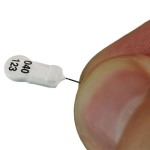
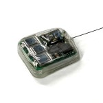
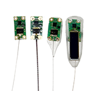
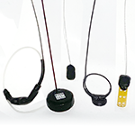
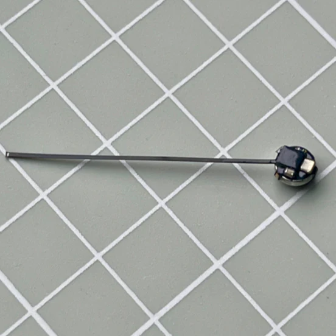
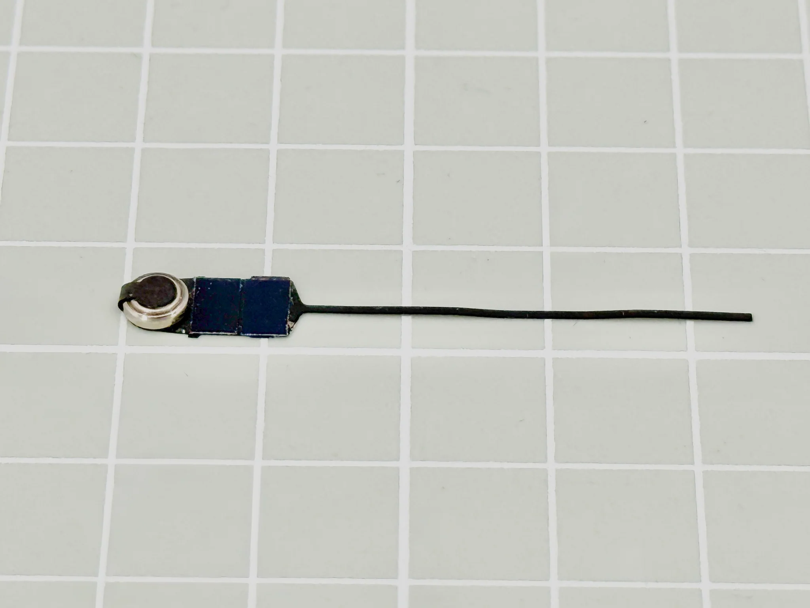

|                                             | [**Lotek Nanotag** ](https://www.lotek.com/products/nanotags/) | [**Lotek Nanotag Solar** ](https://www.lotek.com/products/solar-nanotags-coded-vhf-for-birds/) | [**CTT LifeTags** ](https://celltracktech.com/products/tag-system/lifetag/) | [**CTT66 PowerTags** ](https://celltracktech.com/products/tag-system/powertag/) | 
<a href="https://celltracktech.com/collections/bluseries-tags/products/ctt-blumorpho"><strong>CTT BlūMorpho</strong> </a> 
 | 
<a href="https://celltracktech.com/collections/bluseries-tags/products/ctt-blubat"><strong>CTT BlūBat</strong></a> 
 | 
<a href="https://celltracktech.com/collections/bluseries-tags/products/ctt-blubird-1"><strong>CTT BlūBird</strong></a> 
 |
| ------------------------------------------- | ----------------------------------------------------------------------------------------------------------- | ------------------------------------------------------------------------------------------------------------------------------------------------------- | --------------------------------------------------------------------------------------------------------------------- | --------------------------------------------------------------------------------------------------------------------------- | ---------------------------------------------------------------------------------------------------------------------------------------------------------------------------------------------------------------------- | ------------------------------------------------------------------------------------------------------------------------------------------------------------------------------------- | ------------------------------------------------------------------------------------------------------------------------------------------------------------------------------------- |
| **Manufacturer**                            | **Lotek**                                                                                                   | **Lotek**                                                                                                                                               | **CTT**                                                                                                               | **CTT**                                                                                                                     | **CTT**                                                                                                                                                                                                                | **CTT**                                                                                                                                                                               | **CTT**                                                                                                                                                                               |
| Frequency                                   | 150.1, 151.5, or 166.380 MHz                                                                                | 150.1, 151.5, or 166.38 MHz                                                                                                                             | 434 MHz                                                                                                               | 434 MHz                                                                                                                     | 2.4 GHz                                                                                                                                                                                                                | 2.4 GHz                                                                                                                                                                               | 2.4 GHz                                                                                                                                                                               |
| Lifespan                                    | Long (20 – 2000 d)                                                                                          | Unlimited                                                                                                                                               | Unlimited                                                                                                             | Long (180 d to yrs)                                                                                                         | Unlimited                                                                                                                                                                                                              |                                                                                                                                                                                       | Unlimited                                                                                                                                                                             |
| Daily active period                         | 24/7 or alternate 12-hour on/off                                                                            | 24/7 (battery and solar powered)                                                                                                                        | Needs sufficient light; works in low light conditions and indirect light.                                             | 24/7                                                                                                                        | Needs sufficient light; works in low light conditions and indirect light.                                                                                                                                              | 24/7                                                                                                                                                                                  | 24/7 (battery and solar powered)                                                                                                                                                      |
| Weight                                      | 0.15 g – 3.00 g                                                                                             | 1.4 g and up                                                                                                                                            | 0.44 g and up                                                                                                         | 0.33 g and up                                                                                                               | 0.06 g                                                                                                                                                                                                                 | 0.16 ± 0.02 g                                                                                                                                                                         | 0.2 g                                                                                                                                                                                 |
| Smallest bird (%3 body weight)              | 5.0 g                                                                                                       | 46.7 g                                                                                                                                                  | 14.7 g                                                                                                                | 11.0 g                                                                                                                      | 2 g                                                                                                                                                                                                                    | 5.3 g                                                                                                                                                                                 | 6.7 g                                                                                                                                                                                 |
| Possible number of unique tags              | >36,000\*                                                                                                   | >36,000\*                                                                                                                                               | \~4 billion                                                                                                           | \~4 billion                                                                                                                 |                                                                                                                                                                                                                        |                                                                                                                                                                                       |                                                                                                                                                                                       |
| Burst intervals                             | \~2-40 seconds                                                                                              | Similar to CTT (may diminish with power loss) \[needs more information]                                                                                 | 2 seconds (configurable)                                                                                              | Programmable: from 1 sec up                                                                                                 | As frequent as once per second                                                                                                                                                                                         | Configurable to 3, 5, 10, 20, 30, or 60 seconds                                                                                                                                       | 3 seconds (standard; configurable upon request)                                                                                                                                       |
| Current number of compatible Motus Stations | 
1200+

<a href="https://motus.org/data/receiversMap/">See receiver map for distribution</a>
     | 
1200+

<a href="https://motus.org/data/receiversMap/">See receiver map for distribution</a>
                                                 | 
487+

<a href="https://motus.org/data/receiversMap/">See receiver map for distribution</a>
                | 
487+

<a href="https://motus.org/data/receiversMap/">See receiver map for distribution</a>
                      |                                                                                                                                                                                                                        |                                                                                                                                                                                       |                                                                                                                                                                                       |
| Compatible with CTT Receivers               | SensorStation with FUNcube Dongle only                                                                      | SensorStation with FUNcube Dongle only                                                                                                                  | Yes                                                                                                                   | Yes                                                                                                                         | CTT Node™ Version 3.0 with dual frequencies or SensorStation with BlūSeries Receiver                                                                                                                                   | CTT Node™ Version 3.0 with dual frequencies or SensorStation with BlūSeries Receiver                                                                                                  | SeCTT Node™ Version 3.0 with dual frequencies or SensorStation with BlūSeries Receiver                                                                                                |
| Compatible with Lotek Receivers             | Yes                                                                                                         | Yes                                                                                                                                                     | No                                                                                                                    | No                                                                                                                          | No                                                                                                                                                                                                                     | No                                                                                                                                                                                    | No                                                                                                                                                                                    |
| Compatible with SensorGnome Receivers       | With FUNcube dongle only                                                                                    | With FUNcube dongle only                                                                                                                                | With CTT Motus Adapter only                                                                                           | With CTT Motus Adapter only                                                                                                 | No                                                                                                                                                                                                                     | No                                                                                                                                                                                    | No                                                                                                                                                                                    |
| Price                                       | \~$200 USD                                                                                                  | \~$200 USD                                                                                                                                              | \~$200 USD                                                                                                            | \~$200 USD                                                                                                                  | \~175 USD                                                                                                                                                                                                              | \~200 USD                                                                                                                                                                             | \~250 USD                                                                                                                                                                             |
| Discount                                    | Contact Lotek                                                                                               | Contact Lotek                                                                                                                                           | 
5% for 20+

10% for 30+
                                                                                   | 
5% for 20+

10% for 30+
                                                                                         |                                                                                                                                                                                                                        |                                                                                                                                                                                       |                                                                                                                                                                                       |

|                                             | [**Lotek Nanotag** ](https://www.lotek.com/products/nanotags/) | [**Lotek Nanotag Solar** ](https://www.lotek.com/products/solar-nanotags-coded-vhf-for-birds/) | [**CTT LifeTags** ](https://celltracktech.com/products/tag-system/lifetag/) | [**CTT66 PowerTags** ](https://celltracktech.com/products/tag-system/powertag/) | 
<a href="https://celltracktech.com/collections/bluseries-tags/products/ctt-blumorpho"><strong>CTT BlūMorpho</strong> </a> 
 | 
<a href="https://celltracktech.com/collections/bluseries-tags/products/ctt-blubat"><strong>CTT BlūBat</strong></a> 
 | 
<a href="https://celltracktech.com/collections/bluseries-tags/products/ctt-blubird-1"><strong>CTT BlūBird</strong></a> 
 |
| ------------------------------------------- | ----------------------------------------------------------------------------------------------------------- | ------------------------------------------------------------------------------------------------------------------------------------------------------- | --------------------------------------------------------------------------------------------------------------------- | --------------------------------------------------------------------------------------------------------------------------- | ---------------------------------------------------------------------------------------------------------------------------------------------------------------------------------------------------------------------- | ------------------------------------------------------------------------------------------------------------------------------------------------------------------------------------- | ------------------------------------------------------------------------------------------------------------------------------------------------------------------------------------- |
| **Manufacturer**                            | **Lotek**                                                                                                   | **Lotek**                                                                                                                                               | **CTT**                                                                                                               | **CTT**                                                                                                                     | **CTT**                                                                                                                                                                                                                | **CTT**                                                                                                                                                                               | **CTT**                                                                                                                                                                               |
| Frequency                                   | 150.1, 151.5, or 166.380 MHz                                                                                | 150.1, 151.5, or 166.38 MHz                                                                                                                             | 434 MHz                                                                                                               | 434 MHz                                                                                                                     | 2.4 GHz                                                                                                                                                                                                                | 2.4 GHz                                                                                                                                                                               | 2.4 GHz                                                                                                                                                                               |
| Lifespan                                    | Long (20 – 2000 d)                                                                                          | Unlimited                                                                                                                                               | Unlimited                                                                                                             | Long (180 d to yrs)                                                                                                         | Unlimited                                                                                                                                                                                                              |                                                                                                                                                                                       | Unlimited                                                                                                                                                                             |
| Daily active period                         | 24/7 or alternate 12-hour on/off                                                                            | 24/7 (battery and solar powered)                                                                                                                        | Needs sufficient light; works in low light conditions and indirect light.                                             | 24/7                                                                                                                        | Needs sufficient light; works in low light conditions and indirect light.                                                                                                                                              | 24/7                                                                                                                                                                                  | 24/7 (battery and solar powered)                                                                                                                                                      |
| Weight                                      | 0.15 g – 3.00 g                                                                                             | 1.4 g and up                                                                                                                                            | 0.44 g and up                                                                                                         | 0.33 g and up                                                                                                               | 0.06 g                                                                                                                                                                                                                 | 0.16 ± 0.02 g                                                                                                                                                                         | 0.2 g                                                                                                                                                                                 |
| Smallest bird (%3 body weight)              | 5.0 g                                                                                                       | 46.7 g                                                                                                                                                  | 14.7 g                                                                                                                | 11.0 g                                                                                                                      | 2 g                                                                                                                                                                                                                    | 5.3 g                                                                                                                                                                                 | 6.7 g                                                                                                                                                                                 |
| Possible number of unique tags              | >36,000\*                                                                                                   | >36,000\*                                                                                                                                               | \~4 billion                                                                                                           | \~4 billion                                                                                                                 |                                                                                                                                                                                                                        |                                                                                                                                                                                       |                                                                                                                                                                                       |
| Burst intervals                             | \~2-40 seconds                                                                                              | Similar to CTT (may diminish with power loss) \[needs more information]                                                                                 | 2 seconds (configurable)                                                                                              | Programmable: from 1 sec up                                                                                                 | As frequent as once per second                                                                                                                                                                                         | Configurable to 3, 5, 10, 20, 30, or 60 seconds                                                                                                                                       | 3 seconds (standard; configurable upon request)                                                                                                                                       |
| Current number of compatible Motus Stations | 
1200+

<a href="https://motus.org/data/receiversMap/">See receiver map for distribution</a>
     | 
1200+

<a href="https://motus.org/data/receiversMap/">See receiver map for distribution</a>
                                                 | 
487+

<a href="https://motus.org/data/receiversMap/">See receiver map for distribution</a>
                | 
487+

<a href="https://motus.org/data/receiversMap/">See receiver map for distribution</a>
                      |                                                                                                                                                                                                                        |                                                                                                                                                                                       |                                                                                                                                                                                       |
| Compatible with CTT Receivers               | SensorStation with FUNcube Dongle only                                                                      | SensorStation with FUNcube Dongle only                                                                                                                  | Yes                                                                                                                   | Yes                                                                                                                         | CTT Node™ Version 3.0 with dual frequencies or SensorStation with BlūSeries Receiver                                                                                                                                   | CTT Node™ Version 3.0 with dual frequencies or SensorStation with BlūSeries Receiver                                                                                                  | SeCTT Node™ Version 3.0 with dual frequencies or SensorStation with BlūSeries Receiver                                                                                                |
| Compatible with Lotek Receivers             | Yes                                                                                                         | Yes                                                                                                                                                     | No                                                                                                                    | No                                                                                                                          | No                                                                                                                                                                                                                     | No                                                                                                                                                                                    | No                                                                                                                                                                                    |
| Compatible with SensorGnome Receivers       | With FUNcube dongle only                                                                                    | With FUNcube dongle only                                                                                                                                | With CTT Motus Adapter only                                                                                           | With CTT Motus Adapter only                                                                                                 | No                                                                                                                                                                                                                     | No                                                                                                                                                                                    | No                                                                                                                                                                                    |
| Price                                       | \~$200 USD                                                                                                  | \~$200 USD                                                                                                                                              | \~$200 USD                                                                                                            | \~$200 USD                                                                                                                  | \~175 USD                                                                                                                                                                                                              | \~200 USD                                                                                                                                                                             | \~250 USD                                                                                                                                                                             |
| Discount                                    | Contact Lotek                                                                                               | Contact Lotek                                                                                                                                           | 
5% for 20+

10% for 30+
                                                                                   | 
5% for 20+

10% for 30+
                                                                                         |                                                                                                                                                                                                                        |                                                                                                                                                                                       |                                                                                                                                                                                       |
