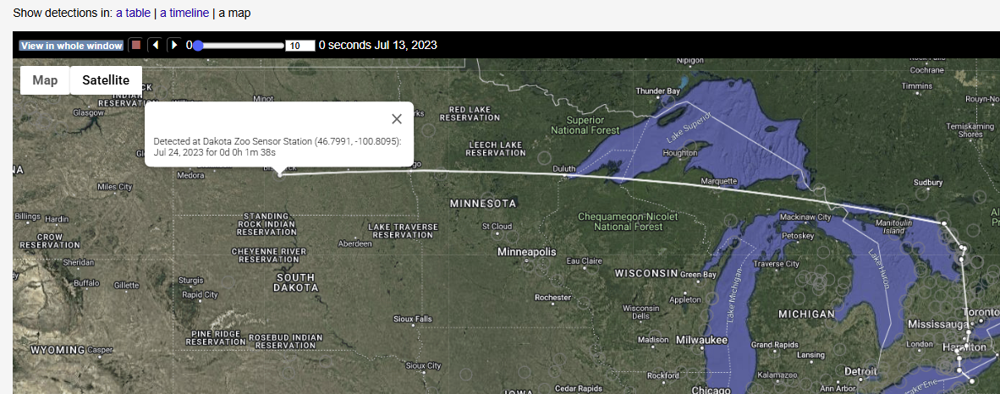
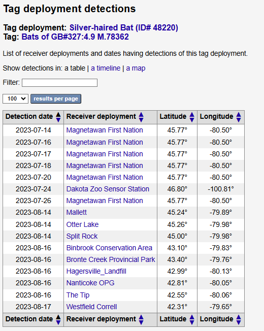
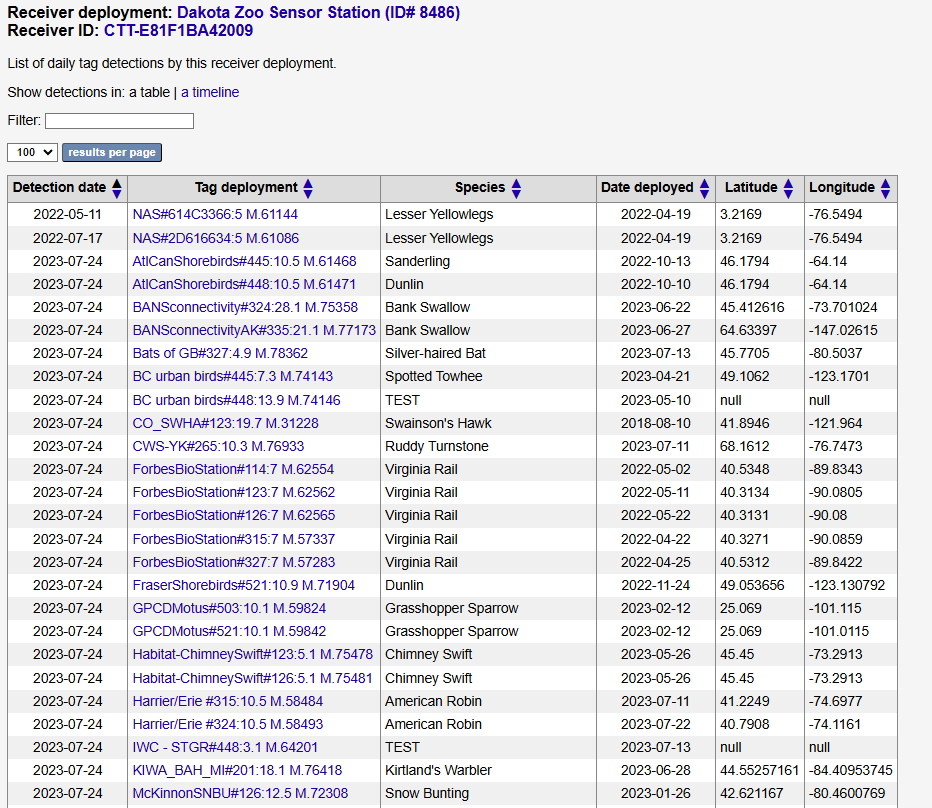
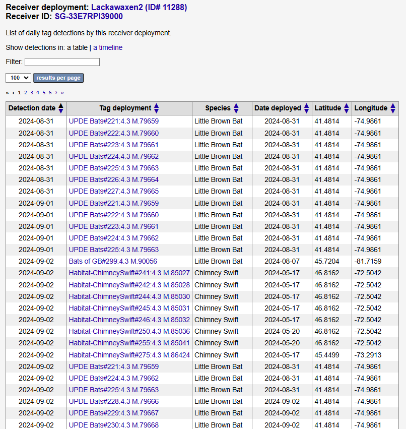
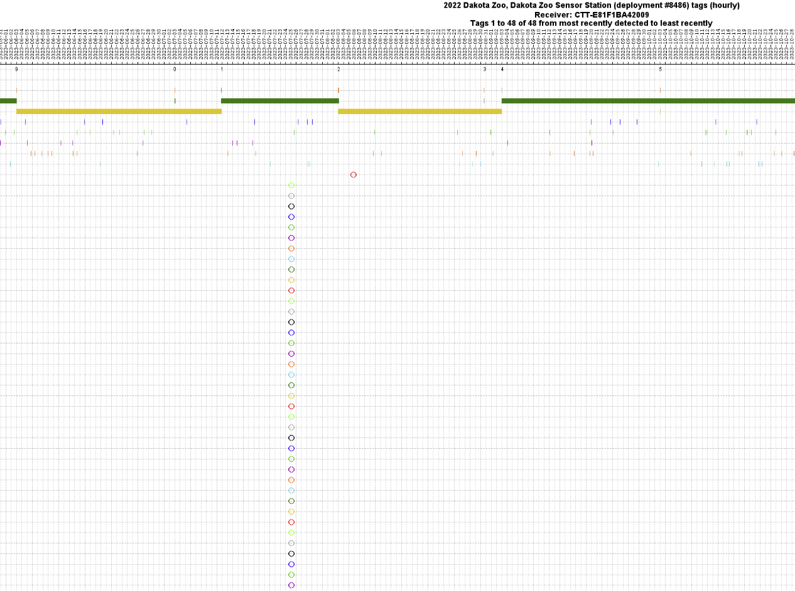
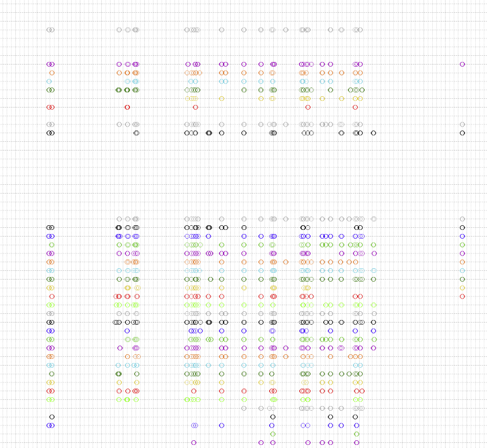

# False Detections

## How do false detections occur

&#x20;In Motus, there are multiple ways in which false detections can occur. The three main causes are below.&#x20;

* **Environmental radio noise:** this can be anthropogenic or natural (from space!). A related situation is when a receiver's gain or noise filtering settings are allowing too much radio data to be recorded. [Read more about noisy stations here](../../stations/station-inspection/noisy-stations.md).
  * Often occurs during discreet periods, resulting in a conspicuous and temporary spike in detections
  * Usually a variety of burst intervals present
  * Usually a variety of species
  * There may be no physical tags present whatsoever
* **Tag aliasing:** Multiple physical tags are all deployed at the same location and time and their signals overlap. Their close physical proximity means the signals emitted by the tags appear very similar to the receiver, making them difficult to tell apart. This can result in the mixing of multiple tag signals which may be misinterpreted as another tag that is not actually present. [Read more about tag aliasing here.](../../tags/tag-aliasing.md)
  * Only occurs when multiple physical tags are present
  * Tags with false detections usually share the burst interval of those present
  * Typically just a few species detected, and often similar to the tagged species present
* **Bad metadata**: researchers haven't entered deployment information for their tags so our system doesn't know they are deployed. Since there is a small degree of tolerance for variability in the tag signal, raw tag data may then resolve to different tags. Note that this is relatively uncommon; it is much more likely in cases of bad metadata that the tags won't be detected at all, until the metadata issue has been resolved and the receiver data reprocessed.

## Identifying False Detections

There are several ways to identify false positives, but typically the first indicator will be intuition. That is, the context of a detection can sometimes provide the most clues, or at least indicate that certain data should be further scrutinized.

The Motus website provides a few options for investigating suspect data at a glance. Below we'll provide some examples of likely false positives on the website and how to assess them using the main tools available: the **tracks map, daily detection summary, and deployment timeline**.&#x20;


Not all false positives are easy to spot, especially those that correspond to preexisting expectations. Researchers should always undertake a systematic investigation of their data in the R package using the approach detailed in the [Data Cleaning chapter](https://motuswts.github.io/motus/articles/05-data-cleaning.html) of the R package documentation.


### Tracks map

Tracks are most obviously false when there are long distance East-West movements, or during the non-migratory period, North-South movements. Some false detections occur at certain stations multiple times, creating a back-and-forth movement which looks false. In other instances, the animal has merely moved out of range and is likely false – that is, unless the animal was tagged as part of a vagrant study (in which case we don't expect them to be in range!).

.png>)

The Silver-haired bat below was tagged in Ontario but the tracks map shows a detection in North Dakota, almost due west of the previous detection. Even without knowing much about the behaviour of this particular bat species, this seems highly improbable. In order to dig a bit deeper, we'll switch to the daily detections summary by clicking the "table" option.

<figure><figcaption></figcaption></figure>


You can click on a point to view the station name and duration of the detections. You can also animate these tracks by pressing the "play" button (forward or backward), which can sometimes lead to additional insights or clues that closer scrutiny is needed.


### Daily detection summary

The detections tables are daily summaries — one row per tag deployment per receiver deployment per 24 hour period, regardless of the duration of the detection. Still, they can be very useful for displaying detection sequence and for spotting clusters of detections.&#x20;

In the case of the Silver-haired bat in the map above, it was detected on multiple consecutive days near the tagging location in Ontario, then four days later it was "detected" in Dakota, then two days later it was back at the same site in Ontario. Clearly, the detection in Dakota is not valid as the speed of travel is not possible.

<figure><figcaption></figcaption></figure>


Tag and receiver deployments are sorted alphabetically for any given day, rather than by the precise time of the detection.


False positives often occur in clusters. Using the same tagged Silver-haired bat as an example, we can see this clearly by clicking on the station's daily summary. Even at a glance, the sheer number of detections on 2023-07-24 looks somewhat suspect, and especially when we look at the species detected. Kirtland's Warbler, Snow Bunting, Grasshopper Sparrow, Dunlin, Silver-haired bat, and Virginia Rail all detected at the same station on the same day?!&#x20;

Looking over the burst intervals present — the number following the colon — shows that there are a variety here, and not just one or two. Based on the variety of both species and burst intervals, the source of these faslse detections was probably noise, rather than aliasing, and every detection on this day is probably false. A different perspective of this same station using the Deployment timeline is shown in the next section on Deployment timelines.

<figure><figcaption></figcaption></figure>

In the example of another station's detection summary, we see a different pattern. Immediately, it's clear that there is less variety overall than in previous example. There are only a few projects present, and importantly, there is only one burst interval represented — 4.3 seconds. A quick look at the project managing the station shows that it's the same group that deployed many of the tags. This then appears to be the result of a local bat tagging project, where all the tagged bats had the same 4.3 burst interval, which in turn resulted in aliased false detections of several other deployments of 4.3 BI tags.

<figure><figcaption></figcaption></figure>

### **Deployment timelines**

In addition to being a very useful tool for determining when stations are functioning as expected, detection timelines are excellent for spotting noise-related false positives. These will look like a spike in tag detections, where several tags that were never detected before are all detected at the same moment and then are usually never detected again. It is common for a noise event to occur when no other tags are being detected, making them stand out. Deployment timelines can be also be useful for spotting tag aliasing, but these aren't quite as conspicuous.


Deployment timelines are currently only accessible by members of the project that manages the station.


Below is the deployment timeline for the Dakota Zoo Sensor Station whose detection summary was displayed above. Typcially, noise related false positives are far easier to spot in the Deployment timeline than in other views due to the spike in "detections" a noise event will create.

<figure><figcaption></figcaption></figure>

Below is another example of a noise-related false positives in the deployment timeline. In this case, the likely cause was not an increase in environmental noise, but rather receiver gain settings that were far too high, with the same end result of recording too much radio noise.

<figure><figcaption></figcaption></figure>

Usually noise-related issues are discreet events. However, some sites suffer from chronic and persistent noise issues. Below is an example of nearly continuous noise-related false positives over a period of one and a half months. Note that the tag codes themselvs tend to repeat. This is common as some tag codes are more prone to noise-related issues than others, and often at any given site, the source and character of the noise may remain somewhat consistent over a period of time. For more information on dealing with noisy sites, please see the further reading [here](../../stations/station-inspection/noisy-stations.md).

<figure><figcaption></figcaption></figure>


Not sure where to find these timelines? [See our chapter on detection timelines.](../../explore/detection-timelines.md)


## How are false detections dealt with?

On the Motus website, automated data filters are applied in conditions where false positives are likely. Primarily this relates to short runs with very few consecutive bursts. This hides the detections from view on the website, but does not affect what data is downloaded in the R package. Because this is an automated process, it will result both in valid detections being flagged and other false positives being missed; the primary aim is to keep the most egregious and obvious false positives off the website.&#x20;

Where obviously false detections do make it through the automated filters — such as those in the examples above — we can "manually" apply these same filters to specific detections, thus hiding them from public view on the website. As with the the automated filters, this only hides them from view on the website; all data remains available in the R package.

[Read more about public data filters here](public-data-filters.md).

### Motus R Package

The proper way to fully deal with false positives — and an essential step for most researchers using Motus data for publishable work — is with the Motus R Package. Data downloaded with the R Package includes all data filtered out of view on the website, as well as important extended properties, such as run length, signal strength, and frequency offset, which are key to fully inspecting and filtering your data. Detailed guidelines are provided in the Motus R Package documentation, primarily in the three sections below.

* [Data Cleaning](https://motuswts.github.io/motus/articles/05-data-cleaning.html)
* [In-depth detection filtering](https://motuswts.github.io/motus/articles/filtering.html)&#x20;
* [A tool to remove probable false positives ](https://motuswts.github.io/motus/articles/identifying-false-positives.html)

## Reporting

If you find obvious false positives on the Motus website, please report them them to us so we can properly flag them and hide them from view. For data downloaded via the [Motus R Package](https://motuswts.github.io/motus/), we only want to know if you have found false detections where `motusFilter` is **not** `0`. That is, if you have found false detections that have _not_ already been flagged.&#x20;

For reporting, send us an email with the **template file below** that includes the following information about each false detection.



* **Tag deployment ID (REQUIRED)**
* **Receiver deployment ID (REQUIRED)**
* **Justification for removal (REQUIRED)**
* Suspected cause of false detection (optional)
* The date the false detection was found (optional)
* Observer name (optional)
* Any additional comments (optional)
