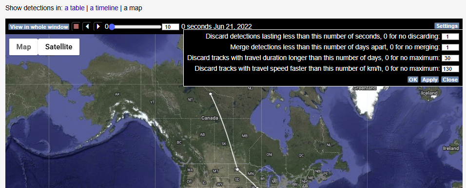

# Public Data Filters

Several filters are applied to detection data displayed on Motus.org in order to limit the number of false detections that are visible to the public. This only affects the visibility on the website; **all** detection data is available for download with the [**Motus R Package**](https://motuswts.github.io/motus/), in most cases assigned `motusFilter == 0`  indicating that the detections were filtered.

Below is a description of the primary ways in which data can be filtered on the website, presented in the order in which the filters are typically applied.


Data filters on Motus.org are a temporary solution using broad-based criteria to prevent the most conspicuous false positives from being displayed on public outputs. Only the data downloaded with the Motus R Package contains all the relevant information needed to properly clean and vet possible false positives and should be considered the definitive source for Motus detection data.


| Filter Name      | Description                      | Included in Motus Filter (R package) |
| ---------------- | -------------------------------- | ------------------------------------ |
| Short runs       | Number of consecutive detections | Yes                                  |
| Manual flagging  | Manually selected detections     | Yes                                  |
| Flight path      | Estimated fligth metrics         | No                                   |
| Local detections | Local tags at noisy stations     | No                                   |

## **Short runs**

Generally speaking, the shorter the detection run — the fewer consecutive hits — the more likely it is to be a false positive. Therefore a filter is applied automatically on all data to prevent short runs from being displayed on the webpage. Due to differences in how Lotek and CTT tags work, the filter is applied under slightly different conditions to each.&#x20;


For both Lotek and CTT tags, detection runs that are filtered will still be available in the R Package, with the filtered runs assigned `motusFilter == 0`


### Lotek tags

* For 'noisy' sites, any run with 4 or fewer consecutive hits is filtered out
* For 'quiet' sites, any run with 3 or fewer consecutive hits is filtered out&#x20;


Noisy sites are categorized as stations with many runs (>= 100 in an `hourBin`) and a high ratio of runs with lengths of 2 at a given time (>= 85% per `hourBin`).


### CTT tags

Because, there are so many more unique tag codes available for CTT tags than Lotek tags, the burst interval is not required to identify particular tags. However, short runs are still more likely to be false positives than longer runs.&#x20;

* Runs with 2 consecutive hits and single hits are filtered out

## Manual flagging

In cases where detections are obviously false, despite the application of the filters above, we can apply a filter directly in the database to hide them from view. We usually refer to this as "flagging" a false detection.

As with the filter for short runs, this will hide all affected detections from the website as well as assign the value of `motusFilter == 0` to the filtered data in the R Package.

Unlike the short runs filter, this will flag every run of a particular `tagDeployID` and `recDeployID` pair, both past and future. As such, it's a fairly blunt tool and best used to hide only the most egregious false detections from the website — particularly when a true detection of that tag at that station is unlikely to ever occur. If you come across obvious false detections on the website, you can report them using the process described [here](false-detections.md#reporting).

## Website-only filtering

The following filters exist only on the website and are not represented in the data downloaded with the R Package.

### Estimated flight paths

In addition to the filters described above, tracks maps incorporate additional filters when generating estimated flight paths. The parameters used to be modified, if desired, by clicking on "settings" on the right hand side of the map.

Estimated flight paths are _not_ included in the data downloaded with the R package so any filtering done here exists only on the website.

<figure><figcaption></figcaption></figure>

### Local detections&#x20;

The new [Explore Dashboard](https://motus.org/dashboard/) sometimes employs an additional form of filtering at stations that are prone to noise, but where filtering out individual tags is not practical. Instead, a "local" filter is applied and all tags whose deployment location falls outside a certain radius from the station are filtered out of view on the website.&#x20;

All detections remain available in the data downloaded with the R package. However there will be no indication in the data that these detections were filtered out on the Explore Dashboard.

## Motus R Package

Despite our best efforts, some false detections will make it through the various filters, and some true detections will be filtered in error. For this reason, all data is available to researchers through the R Package, along with many extended properties that aren't available on the website, to allow for in- depth vetting and filtering. The Motus R Package documentation offers an extensive resource for this process including, but not limited to, the following chapters:

* [Data Cleaning](https://motuswts.github.io/motus/articles/05-data-cleaning.html)
* [In-depth detection filtering](https://motuswts.github.io/motus/articles/filtering.html)&#x20;
* [A tool to remove probable false positives ](https://motuswts.github.io/motus/articles/identifying-false-positives.html)
