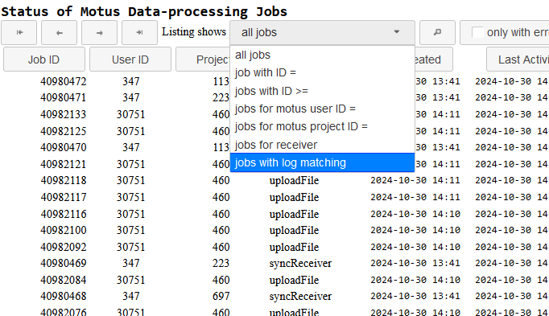
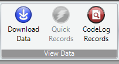

# Reprocessing receiver data

## Why reprocess receiver data

Detection data is regularly reprocessed (also referred to as "rerun") following the initial upload and processing. This is primarily required to account for changes in metadata. As described [here](../../project-management/tag-management/tag-metadata.md#entering-metadata), proper metadata management is essential for identifying tags, in particular Lotek tags.&#x20;

Put simply, if a tag does not does have an active deployment _at the time the receiver data was originally processed_ that covers the period of the detection, that tag will not be among the candidate tags that the _tagfinder_ algorithm has at its disposal when attempting to match raw data with known tags. In other words, your tag will not be detected.

Sometimes even despite best efforts, tag metadata is either not present or not correct when detection data is first processed. This makes repeated reprocessing of receiver data a necessity.


Detection is reprocessed at the **receiver** level and not by the tagging project.


## When is receiver data reprocessed?

There is no fixed schedule as to how often receivers are rerun, but typically it is within the first 1-2 months of first upload, then roughly every 3 months to 6 months after that, decreasing in frequency as more time has elapsed since when it was first recorded and processed

## How to check the most recent rerun date

The record of a receiver's rerun history is found in the job logs for that receiver. There are two methods of checking this, described in the tabs below.



A searchable list of data processing jobs, including receiver reruns, can be found at [https://sgdata.motus.org/status](https://sgdata.motus.org/status).

* Visit [https://sgdata.motus.org/status](https://sgdata.motus.org/status)
* Log in with your regular Motus login
* Filter for the desired receiver by clicking "all jobs" then selecting "jobs with logs matching"

<figure><figcaption></figcaption></figure>

* Enter the serial number you want **without the prefix**. So if interested in receiver "CTT-54A61DB0C752", you'd search for "54A61DB0C752" and if interested in receiver "Lotek-000162" you'd search for "000162".
* View the resulting list and look for the most recent rerun. Clicking anywhere on the line will bring up a dialog box with additional info and job log.
* You can also use this page to summarize by project or to find a specific job log


This page is often very slow to respond and difficult to access




A list of recent jobs for a project, including reruns, is available at the bottom of the[ "Upload detection data" page.](https://motus.org/data/project/sgJobs) This page has some basic filtering but cannot be searched, so tends only to be useful for recent jobs.

<figure><figcaption></figcaption></figure>

&#x20;



## Why detections can sometimes appear or change after reprocessing

Though receiver reprocessing is unavoidable given the constraints of the current technology, it can lead to some surprising results, primarily when detections that were previously seen disappear entirely, or are changed to different tags.&#x20;

#### Detections don't appear after first upload but do appear after reprocessing

This is the most common and straightforward case. Usually it is a matter of researchers forgetting to update their tag metadata prior to uploading a station's data. It's also more likely to occur when deploying tags near internet-connected stations, as they often upload data before the updated metadata is present in the system.&#x20;

This is the most common answer to the question of why no detections are showing up despite having tagged in the near vicinity of an active station.

#### Detections change to different tags after reprocessing

In this case, rather than there being no candidate tags whatsoever that might match the raw data, as in the previous case, there _are_ tags with active deployments that are potential candidate tags. Due to the allowed tolerance of tag signal properties, sometimes a less suitable candidate tag is selected by tagfinder if the more suitable one is unavailable. Once the proper tag metadata has been updated and the receiver reprocessed, it will resolve to the correct tag.

#### Detections that did appear then later disappear&#x20;

This is not directly related to receiver reprocessing, but worth describing here along with the other cases. This is when detections are later identified as false positives, either related to aliasing or a noise event, and are flagged in the database. Flagging them will remove them from all the the detection summaries on Motus.org, but not the complete data downloaded with the R package, where the runs and hits will be assigned the value of `motusFilter == 1` . Read more about that [here](false-detections.md).
