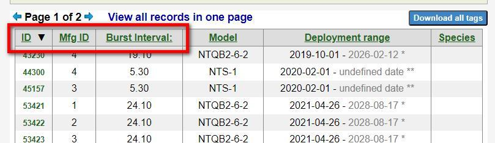
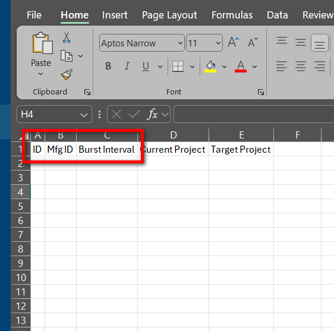

# Move tags to another project

To move tags from one Motus Project to another, we need to know the tag database ID’s of the the tags to be moved as well as the project number they are to be moved to. To facilitate this process and to ensure that the correct tags are moved, we have provided a Move Tags Template file to be filled out and to us.

### 1) Download the Move Tags Template file below



### 2) Visit your station’s [Manage Tags](https://motus.org/data/project/tags) page

Copy the **ID**, **Mfg ID**, and **Burst Interval** of the tags you wish to move.

<figure><figcaption></figcaption></figure>


_There are a couple easy ways to copy columns in a table on a website depending on the browser you use:_\

* _Firefox: hold down the CTRL key while clicking and dragging with your mouse_
* _Chrome or Edge: use an add-on like_ [_Copytables_ ](https://chromewebstore.google.com/detail/copytables/ekdpkppgmlalfkphpibadldikjimijon)


### 3) Paste those details into the Move Tags Template

The **first three columns** in the template correspond to the **first three columns** on your project’s Manage Tags page.

<figure><figcaption></figcaption></figure>

### 4) Add the project numbers of both current and **target** projects of the tags you wish to move


Just add the project _numbers_. There is no need to add the project names.


### 5) Email the completed file to [Motus](mailto:motus@birdscanada.org)
