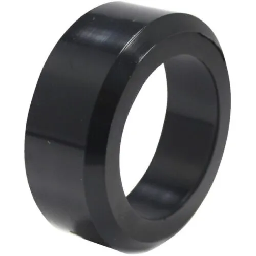

# Part descriptions

<table><thead><tr><th>Part</th><th>Description</th><th width="100">Image</th></tr></thead><tbody><tr><td>4'' Ground Anchor</td><td></td><td></td></tr><tr><td>Copper swage sleeve</td><td></td><td></td></tr><tr><td>Stainless Steel Carabiner - M6</td><td></td><td></td></tr><tr><td>Galvenized Steel Eye to Eye Turnbuckles - 5"</td><td></td><td></td></tr><tr><td>Stainless Steel Wire Rope - 3/32"</td><td></td><td></td></tr><tr><td>Stainless Steel Wire Rope Thimble - M3</td><td></td><td></td></tr><tr><td>Battery (AGM, ~100 Ah)</td><td></td><td></td></tr><tr><td>Battery (AGM, ~50 Ah)</td><td></td><td></td></tr><tr><td>Battery (LiFePo, ~100 Ah)</td><td></td><td></td></tr><tr><td>Charge Controller (SS-10L-12V)</td><td></td><td></td></tr><tr><td>Fused Battery Leads</td><td></td><td></td></tr><tr><td>Mounting hardware to attach solar panel</td><td></td><td></td></tr><tr><td>Solar Panel (160 Watts)</td><td></td><td></td></tr><tr><td>Solar Panel (80 Watts)</td><td></td><td></td></tr><tr><td>Spade Terminal Connectors</td><td></td><td></td></tr><tr><td>Solar panel wiring harness (MC4)</td><td></td><td></td></tr><tr><td>Aluminum angle iron (units in feet)</td><td></td><td></td></tr><tr><td>Nylon washer - 5/16"</td><td></td><td></td></tr><tr><td>Stainless steel hex bolt - 7/16" (head), 1" (length)</td><td></td><td></td></tr><tr><td>Stainless steel hex bolt - 7/16" (head), 2" (length)</td><td></td><td></td></tr><tr><td>Stainless steel lock washer - 5/16"</td><td></td><td></td></tr><tr><td>Stainless steel nuts - 7/16"</td><td></td><td></td></tr><tr><td>Stainless steel lock nuts - 7/16"</td><td></td><td></td></tr><tr><td>Stainless steel washer - 5/16"</td><td></td><td></td></tr><tr><td>Pipe Bushing</td><td></td><td></td></tr><tr><td>Pipe Elbow</td><td></td><td></td></tr><tr><td>Storage bin (Action Packer)</td><td></td><td></td></tr><tr><td>Mast Wall mount - 24-inch</td><td></td><td></td></tr><tr><td>Golden nugget bracketed tower section (16-gauge)</td><td></td><td></td></tr><tr><td>DMX 32-Foot Medium Duty Self-Supporting Tower</td><td></td><td></td></tr><tr><td>DMX 48-Foot Heavy Duty Self-Supporting Tower</td><td></td><td></td></tr><tr><td>Base plate (BP-125)</td><td></td><td></td></tr><tr><td>Base plate (DMXB)</td><td></td><td></td></tr><tr><td>Base plate (GNBP)</td><td></td><td></td></tr><tr><td>Climbing guard (DMX section 6)</td><td></td><td></td></tr><tr><td>Climbing guard (DMX section 4)</td><td></td><td></td></tr><tr><td>Climbing guard (CS-GN)</td><td></td><td></td></tr><tr><td>Concrete slab</td><td></td><td></td></tr><tr><td>DMX Concrete Base Stubs (CBS-04)</td><td></td><td></td></tr><tr><td>DMX Concrete Base Stubs (CBS-05)</td><td></td><td></td></tr><tr><td>DMX Concrete Base Stubs (CBS-08)</td><td></td><td></td></tr><tr><td>Drive stakes (DMBS)</td><td></td><td></td></tr><tr><td>Guy stations (GS-GN)</td><td></td><td></td></tr><tr><td>Mast - 40A</td><td></td><td></td></tr><tr><td>Masting (DM Mast)</td><td></td><td></td></tr><tr><td>Top kit (244A)</td><td></td><td></td></tr><tr><td>Tripod</td><td></td><td></td></tr><tr><td>Universal house Brackets (GNHB)</td><td></td><td></td></tr><tr><td>VMOT-3NF Antenna Assembly</td><td></td><td></td></tr><tr><td>Vertical Mounting Bracket for J166R-NF, 1.0" to 2.0"</td><td></td><td></td></tr><tr><td>FUNcube Dongle ProPlus</td><td></td><td></td></tr><tr><td>USB A Extender (6")</td><td></td><td></td></tr><tr><td>SMA male to N female bulkhead - 15 or 30 cm</td><td></td><td></td></tr><tr><td>N-type dust cap</td><td></td><td></td></tr><tr><td>9E166-NF 9-element Yagi antenna</td><td></td><td></td></tr><tr><td>Pre-existing tower structure</td><td></td><td></td></tr><tr><td>Laird YS4306</td><td></td><td></td></tr><tr><td>JU400-40NM-NM Coax jumper - 40' long N-male to N-male</td><td></td><td></td></tr><tr><td>RPi 4B (2 GB, 4 GB, 8 GB)</td><td></td><td></td></tr><tr><td>Terminal block (2-position)</td><td></td><td></td></tr><tr><td>16 AWG ring terminal connector</td><td></td><td></td></tr><tr><td>16 AWG, 2-conductor wiring (100 feet)</td><td></td><td></td></tr><tr><td>USB A to USB micro B</td><td></td><td></td></tr><tr><td>USB A inline switch</td><td></td><td></td></tr><tr><td>USB-A DC-DC buck converter (3 A)</td><td></td><td></td></tr><tr><td>Adafruit GPS Hat</td><td></td><td></td></tr><tr><td>Pelican Case - Protector 1150</td><td></td><td></td></tr><tr><td>Pelican Case - Protector 1400</td><td></td><td></td></tr><tr><td>Adafruit Feather with SMA (RFM69HCW 433 MHz)</td><td></td><td></td></tr><tr><td>RPi 4G/LTE Cellular Modem Kit - EG25-G (Global)</td><td></td><td></td></tr><tr><td>SensorStation (Wi-Fi)</td><td></td><td></td></tr><tr><td>NEMA Case (NBF-32318)</td><td></td><td></td></tr><tr><td>SensorStation (Cellular)</td><td></td><td></td></tr><tr><td>SensorStation</td><td></td><td></td></tr><tr><td>Cellular data for SensorGnome (SixFab; monthly)</td><td></td><td></td></tr><tr><td>Cellular data for SensorStation (CTT; monthly)</td><td></td><td></td></tr><tr><td>Iridium data for SensorStation (CTT; monthly)</td><td></td><td></td></tr><tr><td>AC Power supply for Raspberry Pi 3 (Micro USB)</td><td></td><td></td></tr><tr><td>AC Power supply for SensorStation</td><td></td><td></td></tr><tr><td>36-Foot Standard Duty Self-Supporting Tower</td><td></td><td></td></tr><tr><td>Expansion eye bolts</td><td></td><td></td></tr><tr><td>Wedge anchor (5/8" x 4 1/2")</td><td></td><td></td></tr><tr><td>Large washer (11/16" ID x 1 1/2" OD)</td><td></td><td></td></tr><tr><td>Solar Charge Controller for LiFePo4</td><td></td><td></td></tr><tr><td>Raspberry Pi 4 case</td><td></td><td></td></tr><tr><td>USB A to USB C</td><td></td><td></td></tr><tr><td>Solar Panel pole mount</td><td></td><td></td></tr><tr><td>GPS antenna</td><td></td><td></td></tr><tr><td>SMA to U.fl</td><td></td><td></td></tr><tr><td>CR1220 battery for GPS Hat</td><td></td><td></td></tr><tr><td>Dual port USB wall adapter</td><td></td><td></td></tr><tr><td>Recessed waterproof AC outlet</td><td></td><td></td></tr><tr><td>50-foot 12-gauge, 3-conductor heavy duty outdoor AC extension cable</td><td></td><td></td></tr><tr><td>PG13.5 cable gland</td><td></td><td></td></tr><tr><td>Galvenized Steel Jaw to Jaw Turnbuckles - 4.5"</td><td></td><td></td></tr><tr><td>Stainless Steel Quick Links (3/16")</td><td></td><td></td></tr><tr><td>Laird PLC1996</td><td></td><td></td></tr><tr><td>AC Power supply (USB-C; SensorGnome)</td><td></td><td></td></tr><tr><td>Yellow Split Wire Loom Tubing</td><td></td><td></td></tr><tr><td>Duct Seal</td><td></td><td></td></tr><tr><td>Spray Foam</td><td></td><td></td></tr><tr><td>Reflective thermal insulation</td><td></td><td></td></tr><tr><td>Foam board insulation</td><td></td><td></td></tr><tr><td>Aluminum Tape</td><td></td><td></td></tr><tr><td>In-line wire tensioner</td><td></td><td></td></tr><tr><td>Electrical tape</td><td></td><td></td></tr><tr><td>Cable ties</td><td></td><td></td></tr><tr><td>Cable tie mount</td><td></td><td></td></tr><tr><td>Self-tapping screws (#10 x 3/4")</td><td></td><td></td></tr><tr><td>Deck screws (treated wood)</td><td></td><td></td></tr><tr><td>Lag bolts (3/8" x 3 1/2")</td><td></td><td></td></tr><tr><td>Metal roofing screws (1 1/2")</td><td></td><td></td></tr><tr><td>Cable guides</td><td></td><td></td></tr><tr><td>Conduit clips (1")</td><td></td><td></td></tr><tr><td>Type N male crimp connectors for LMR 400</td><td></td><td></td></tr><tr><td>Heat shrink tubing</td><td></td><td></td></tr><tr><td>Wi-Fi Repeater</td><td></td><td></td></tr><tr><td>Wi-Fi Long Range Extender</td><td></td><td></td></tr></tbody></table>

