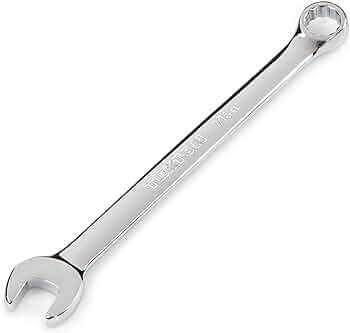
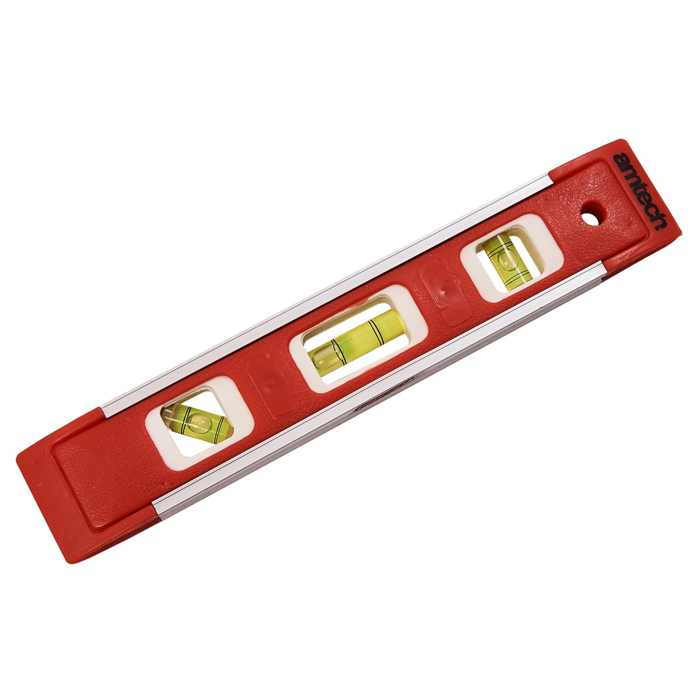
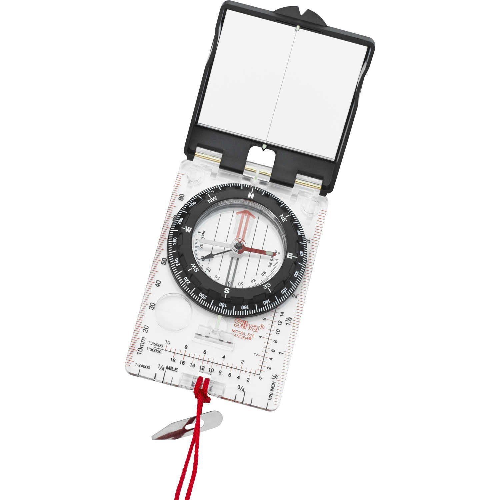
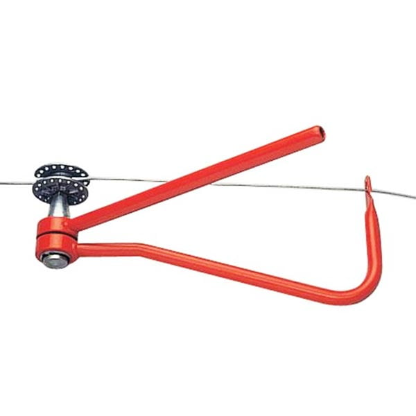
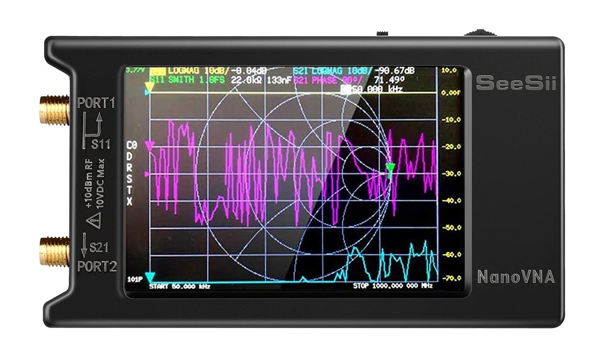

# Tool descriptions


Filter the table below based on the specifications of your station.&#x20;

**Station Configuration**

Select all that apply. For example, if selecting Rock-Anchored, select an additional attachment method (e.g., Building-Bracketed or Guy-Wired) to generate a complete list of recommended tools.&#x20;

**Power Source**

The source used to power the receiver at the station.&#x20;

**Receiver Type**

The computer installed at the station. Options are a Cellular Tracking Technology SensorStation or a SensorGnome (i.e., a Raspberry Pi).&#x20;

**Station Activity**

Indicates whether the station is being installed for the first time or whether tools are being brought for inspection or maintenance of an existing station. The tools listed for maintenance are a minimum recommended sets. However, all installation tools are recommended for each visit to ensure you are prepared for unexpected needs or adjustments.


<table data-header-hidden="false" data-header-sticky><thead><tr><th width="139">Name</th><th width="128">Description</th><th width="91">Picture</th><th width="229">Station Configuration<select multiple><option value="drTmHGj7abM5" label="Guy-Wired Lattice Tower" color="blue"></option><option value="ssWGyVUeQ05g" label="Building-Bracketed Lattice Tower" color="blue"></option><option value="f4SA4ZAQurTT" label="Co-Located on Existing Tower" color="blue"></option><option value="V5Qfnw3qKkpM" label="Rock-Anchored Lattice Tower" color="blue"></option></select></th><th>Power Source<select multiple><option value="GdGmXnKmVxpu" label="Battery and Solar" color="blue"></option><option value="JsXjaffR2MwJ" label="AC" color="blue"></option></select></th><th>Receiver Type<select multiple><option value="TWQK1HBowlAi" label="SensorStation" color="blue"></option><option value="Bt3ai8oXpfWk" label="SensorGnome" color="blue"></option></select></th><th width="232">Use<select multiple><option value="3G2JpD9dbLPo" label="Installation" color="blue"></option><option value="98bQTDFg3xPH" label="Inspection and Maintenance" color="blue"></option></select></th></tr></thead><tbody><tr><td>Impact driver</td><td>Used for driving bolts and screws of all types and sizes</td><td></td><td>Guy-Wired Lattice Tower, Building-Bracketed Lattice Tower, Co-Located on Existing Tower</td><td>Battery and Solar, AC</td><td>SensorStation, SensorGnome</td><td>Installation, Inspection and Maintenance</td></tr><tr><td>Drill</td><td>Used for drilling holes</td><td></td><td>Guy-Wired Lattice Tower, Building-Bracketed Lattice Tower, Co-Located on Existing Tower</td><td>Battery and Solar, AC</td><td>SensorStation, SensorGnome</td><td>Installation, Inspection and Maintenance</td></tr><tr><td>Heat gun</td><td>To heat shrink when making own coax cables</td><td></td><td>Guy-Wired Lattice Tower, Building-Bracketed Lattice Tower, Co-Located on Existing Tower</td><td>Battery and Solar, AC</td><td>SensorStation, SensorGnome</td><td>Inspection and Maintenance, Installation</td></tr><tr><td>Angle grinder</td><td>To cut through metal (e.g., aluminum angle or strut channels) Note: Need to buy cut-off wheel seperately.</td><td></td><td>Guy-Wired Lattice Tower, Building-Bracketed Lattice Tower, Co-Located on Existing Tower</td><td>Battery and Solar, AC</td><td>SensorStation, SensorGnome</td><td>Installation</td></tr><tr><td>Rotary Hammer</td><td>For drilling into rock or concrete. Fits SDS plus bits.</td><td></td><td>Rock-Anchored Lattice Tower</td><td>Battery and Solar, AC</td><td>SensorStation, SensorGnome</td><td>Installation</td></tr><tr><td>Dewalt batteries (Spares)</td><td>Always have lots of spares ready and charged.</td><td></td><td>Guy-Wired Lattice Tower, Building-Bracketed Lattice Tower, Co-Located on Existing Tower, Rock-Anchored Lattice Tower</td><td>Battery and Solar, AC</td><td>SensorStation, SensorGnome</td><td>Installation, Inspection and Maintenance</td></tr><tr><td>Deep impact sockets, 1/2" drive (7/16”, 1/2", 9/16”, 15/16")</td><td>Only 4 sizes needed. Important to get non-chrome plated since impact driver will cause them to chip.</td><td></td><td>Guy-Wired Lattice Tower, Building-Bracketed Lattice Tower, Co-Located on Existing Tower</td><td>Battery and Solar, AC</td><td>SensorStation, SensorGnome</td><td>Installation, Inspection and Maintenance</td></tr><tr><td>Standard metric socket set (1/4 " drive)</td><td>7mm, 8mm, and 10 mm are used most for assembling ZDA antennas. </td><td></td><td>Guy-Wired Lattice Tower, Building-Bracketed Lattice Tower, Co-Located on Existing Tower</td><td>Battery and Solar, AC</td><td>SensorStation, SensorGnome</td><td>Installation, Inspection and Maintenance</td></tr><tr><td>Hex socket adapters (1/4", 3/8", 1/2")</td><td>Attaches to impact driver for use with deep impact sockets.</td><td></td><td>Guy-Wired Lattice Tower, Building-Bracketed Lattice Tower, Co-Located on Existing Tower</td><td>Battery and Solar, AC</td><td>SensorStation, SensorGnome</td><td>Installation, Inspection and Maintenance</td></tr><tr><td>Impact Hex Nutsetter bit (1/4" and 5/16")</td><td>Used with hose clamps (1/4") and self-tapping screws (5/16")</td><td></td><td>Guy-Wired Lattice Tower, Building-Bracketed Lattice Tower</td><td>Battery and Solar, AC</td><td>SensorStation, SensorGnome</td><td>Installation, Inspection and Maintenance</td></tr><tr><td>Impact Bit Set</td><td>Mainly for Roberson's (square) and Phillip's (cross) bits. It's handy to have multiple of each on a holder like this (with a carabiner).</td><td></td><td>Guy-Wired Lattice Tower, Building-Bracketed Lattice Tower, Co-Located on Existing Tower</td><td>Battery and Solar, AC</td><td>SensorStation, SensorGnome</td><td>Installation, Inspection and Maintenance</td></tr><tr><td>Mini screw driver set</td><td>Better to get individual screwdrivers than interchangeable bits since it's easy to loose pieces.</td><td></td><td>Guy-Wired Lattice Tower, Building-Bracketed Lattice Tower, Co-Located on Existing Tower</td><td>AC, Battery and Solar</td><td>SensorStation, SensorGnome</td><td>Installation, Inspection and Maintenance</td></tr><tr><td>Automatic wire strippers</td><td>There are two varieties that exist - either will work.</td><td></td><td>Guy-Wired Lattice Tower, Building-Bracketed Lattice Tower, Co-Located on Existing Tower</td><td>Battery and Solar, AC</td><td>SensorStation, SensorGnome</td><td>Installation, Inspection and Maintenance</td></tr><tr><td>Wire rope cutter</td><td>For cutting guy wire. Don't go cheap with these - get the expensive ones!</td><td></td><td>Guy-Wired Lattice Tower</td><td>Battery and Solar, AC</td><td>SensorStation, SensorGnome</td><td>Installation, Inspection and Maintenance</td></tr><tr><td>Channel locks</td><td>Handy for all sorts of things. Get a brand name pair - non-brand versions can be very frustrating to use</td><td></td><td>Building-Bracketed Lattice Tower, Guy-Wired Lattice Tower, Co-Located on Existing Tower</td><td>Battery and Solar, AC</td><td>SensorStation, SensorGnome</td><td>Installation, Inspection and Maintenance</td></tr><tr><td>Wrenches (7/16”, 1/2", 9/16”, 15/16", 10mm)</td><td>Helpful to have in addition to the sockets. Don't get the ratcheting wrenches.</td><td></td><td>Guy-Wired Lattice Tower, Building-Bracketed Lattice Tower, Co-Located on Existing Tower</td><td>Battery and Solar, AC</td><td>SensorStation, SensorGnome</td><td>Installation, Inspection and Maintenance</td></tr><tr><td>SDS plus masonry bit (5/8” x 6")</td><td>For drilling in anchors to rock or concrete</td><td></td><td>Rock-Anchored Lattice Tower</td><td>Battery and Solar, AC</td><td>SensorStation, SensorGnome</td><td>Installation</td></tr><tr><td>Swage tool</td><td>For crimping guy wire sleeves</td><td></td><td>Guy-Wired Lattice Tower</td><td>Battery and Solar, AC</td><td>SensorStation, SensorGnome</td><td>Installation, Inspection and Maintenance</td></tr><tr><td>Bolt cutters</td><td>Sometimes bolts get cross-threaded or corroded and need to be cut off.</td><td></td><td>Guy-Wired Lattice Tower, Co-Located on Existing Tower, Building-Bracketed Lattice Tower</td><td>Battery and Solar, AC</td><td>SensorStation, SensorGnome</td><td>Inspection and Maintenance</td></tr><tr><td>Level</td><td>For making sure the tower structure is vertical.</td><td></td><td>Guy-Wired Lattice Tower, Building-Bracketed Lattice Tower, Co-Located on Existing Tower</td><td>Battery and Solar, AC</td><td>SensorStation, SensorGnome</td><td>Installation</td></tr><tr><td>Compass or compass app on phone</td><td>To checking antenna directions.</td><td></td><td>Guy-Wired Lattice Tower, Building-Bracketed Lattice Tower, Co-Located on Existing Tower</td><td>Battery and Solar, AC</td><td>SensorStation, SensorGnome</td><td>Installation, Inspection and Maintenance</td></tr><tr><td>Mini sledge</td><td>To drive in anchors.  </td><td></td><td>Guy-Wired Lattice Tower, Building-Bracketed Lattice Tower, Rock-Anchored Lattice Tower</td><td>Battery and Solar, AC</td><td>SensorStation, SensorGnome</td><td>Installation, Inspection and Maintenance</td></tr><tr><td>Hammer</td><td>Helpful for moving stubborn housing brackets.</td><td></td><td>Building-Bracketed Lattice Tower</td><td>Battery and Solar, AC</td><td>SensorStation, SensorGnome</td><td>Installation</td></tr><tr><td>Multibit screwdriver</td><td>For (un)tightening screws.</td><td></td><td>Guy-Wired Lattice Tower, Building-Bracketed Lattice Tower, Co-Located on Existing Tower</td><td>Battery and Solar, AC</td><td>SensorStation, SensorGnome</td><td>Installation, Inspection and Maintenance</td></tr><tr><td>Phillips (cross) screwdriver</td><td>Backup to multibit screwdriver.</td><td></td><td>Guy-Wired Lattice Tower, Building-Bracketed Lattice Tower, Co-Located on Existing Tower</td><td>Battery and Solar, AC</td><td>SensorStation, SensorGnome</td><td>Installation, Inspection and Maintenance</td></tr><tr><td>Drill bit kit (Cobalt)</td><td>For drilling pilot holes or bolt holes.</td><td></td><td>Co-Located on Existing Tower, Building-Bracketed Lattice Tower, Guy-Wired Lattice Tower</td><td>Battery and Solar, AC</td><td>SensorStation, SensorGnome</td><td>Installation</td></tr><tr><td>Bridge reamers (3/8", 1/2", 5/8", 3/4")</td><td>For creating clean, even bolt holes in metal. </td><td>

</td><td>Co-Located on Existing Tower</td><td>Battery and Solar, AC</td><td>SensorStation, SensorGnome</td><td>Installation</td></tr><tr><td>Clear plastic tubing (3/8" , 12" long)</td><td>To clear dust from holes drilled into rock or concrete</td><td></td><td>Rock-Anchored Lattice Tower</td><td>Battery and Solar, AC</td><td>SensorStation, SensorGnome</td><td>Installation</td></tr><tr><td>Safety Glasses</td><td>Use whenever using drill or rock hammer, or when working under someone.</td><td></td><td>Guy-Wired Lattice Tower, Building-Bracketed Lattice Tower, Co-Located on Existing Tower, Rock-Anchored Lattice Tower</td><td>Battery and Solar, AC</td><td>SensorStation, SensorGnome</td><td>Installation</td></tr><tr><td>Hard hat</td><td>Use whenever working below equipment or people.</td><td></td><td>Guy-Wired Lattice Tower, Building-Bracketed Lattice Tower, Co-Located on Existing Tower</td><td>Battery and Solar, AC</td><td>SensorStation, SensorGnome</td><td>Installation, Inspection and Maintenance</td></tr><tr><td>Work gloves</td><td>Use to keep hands clean and safe from injury.</td><td></td><td>Guy-Wired Lattice Tower, Building-Bracketed Lattice Tower, Co-Located on Existing Tower, Rock-Anchored Lattice Tower</td><td>Battery and Solar, AC</td><td>SensorStation, SensorGnome</td><td>Installation, Inspection and Maintenance</td></tr><tr><td>Fall protection</td><td>For working from heights. Check local rules and regulations for equipment and certification required. </td><td></td><td>Building-Bracketed Lattice Tower, Co-Located on Existing Tower, Rock-Anchored Lattice Tower, Guy-Wired Lattice Tower</td><td>Battery and Solar, AC</td><td>SensorStation, SensorGnome</td><td>Installation, Inspection and Maintenance</td></tr><tr><td>N-95 masks</td><td>Use whenever drilling into rock, concrete, or metal.</td><td></td><td>Rock-Anchored Lattice Tower, Co-Located on Existing Tower, Building-Bracketed Lattice Tower</td><td>Battery and Solar, AC</td><td>SensorStation, SensorGnome</td><td>Installation</td></tr><tr><td>Tape measure</td><td>For measuring.</td><td></td><td>Guy-Wired Lattice Tower, Building-Bracketed Lattice Tower, Co-Located on Existing Tower</td><td>Battery and Solar, AC</td><td>SensorStation, SensorGnome</td><td>Installation, Inspection and Maintenance</td></tr><tr><td>In-line wire tensioner tool</td><td>Makes tensioning guy wire spools a whole lot easier.</td><td></td><td>Guy-Wired Lattice Tower</td><td>Battery and Solar, AC</td><td>SensorStation, SensorGnome</td><td>Installation, Inspection and Maintenance</td></tr><tr><td>Ratchet wrench (1/2" drive)</td><td>A backup for impact driver as well as in-line wire tensioner tool</td><td></td><td>Guy-Wired Lattice Tower, Building-Bracketed Lattice Tower, Co-Located on Existing Tower</td><td>Battery and Solar, AC</td><td>SensorStation, SensorGnome</td><td>Installation, Inspection and Maintenance</td></tr><tr><td>Ratchet wrench (1/4" drive)</td><td>A backup for impact driver</td><td></td><td>Guy-Wired Lattice Tower, Building-Bracketed Lattice Tower, Co-Located on Existing Tower</td><td>Battery and Solar, AC</td><td>SensorStation, SensorGnome</td><td>Installation, Inspection and Maintenance</td></tr><tr><td>RG58 Coax Wire Stripper</td><td>Used for thinner coax cables, such as RG58</td><td></td><td>Guy-Wired Lattice Tower, Building-Bracketed Lattice Tower, Co-Located on Existing Tower</td><td>Battery and Solar, AC</td><td>SensorStation, SensorGnome</td><td>Installation, Inspection and Maintenance</td></tr><tr><td>LMR400 Coax Wire Stripper</td><td>Used exclusively for LMR400</td><td></td><td>Guy-Wired Lattice Tower, Building-Bracketed Lattice Tower, Co-Located on Existing Tower</td><td>Battery and Solar, AC</td><td>SensorStation, SensorGnome</td><td>Installation, Inspection and Maintenance</td></tr><tr><td>Ratcheting Coax Crimper</td><td>For crimping on coax connectors</td><td></td><td>Guy-Wired Lattice Tower, Building-Bracketed Lattice Tower, Co-Located on Existing Tower</td><td>Battery and Solar, AC</td><td>SensorStation, SensorGnome</td><td>Installation, Inspection and Maintenance</td></tr><tr><td>Coax Cutter</td><td>For cutting coax cable</td><td></td><td>Guy-Wired Lattice Tower, Building-Bracketed Lattice Tower, Co-Located on Existing Tower</td><td>Battery and Solar, AC</td><td>SensorStation, SensorGnome</td><td>Installation, Inspection and Maintenance</td></tr><tr><td>Spade bits (1/2" and 1 1/2")</td><td>For drilling deep holes through walls to allow for AC extension cord (1/2") or coax cables (1 1/2").</td><td></td><td>Building-Bracketed Lattice Tower</td><td>AC</td><td>SensorStation, SensorGnome</td><td>Installation</td></tr><tr><td>Hole saw (2 1/2")</td><td>
A) For drilling shallow holes through walls to allow for AC extension cord (1/2") or coax cables (1 1/2").  B) Or for making holes in storage boxes (e.g., Action Packers) for elbow joint. 

Note: Important to get hole saw with the right-fitting shaft.
</td><td></td><td>Guy-Wired Lattice Tower, Building-Bracketed Lattice Tower, Co-Located on Existing Tower</td><td>Battery and Solar, AC</td><td>SensorStation, SensorGnome</td><td>Installation</td></tr><tr><td>Step drill bit  (3/8" driver, 1/4" - 1-3/8" hole sizes)</td><td>For drilling shallow holes through polycase.  </td><td></td><td>Guy-Wired Lattice Tower, Building-Bracketed Lattice Tower, Co-Located on Existing Tower, Rock-Anchored Lattice Tower</td><td>Battery and Solar, AC</td><td>SensorStation, SensorGnome</td><td>Installation</td></tr><tr><td>Tool belt</td><td>There are several different styles - get one that suits you the best!</td><td></td><td>Guy-Wired Lattice Tower, Building-Bracketed Lattice Tower, Co-Located on Existing Tower</td><td>Battery and Solar, AC</td><td>SensorStation, SensorGnome</td><td>Installation, Inspection and Maintenance</td></tr><tr><td>Tool belt drill holster</td><td>For holding small power tools.</td><td></td><td>Guy-Wired Lattice Tower, Building-Bracketed Lattice Tower, Co-Located on Existing Tower</td><td>Battery and Solar, AC</td><td>SensorStation, SensorGnome</td><td>Installation, Inspection and Maintenance</td></tr><tr><td>Tool box</td><td>For storing tools.</td><td></td><td>Guy-Wired Lattice Tower, Building-Bracketed Lattice Tower, Co-Located on Existing Tower</td><td>Battery and Solar, AC</td><td>SensorStation, SensorGnome</td><td>Installation, Inspection and Maintenance</td></tr><tr><td>Parts organizer</td><td>For sorting all the various nuts, bolts, screws, or other small spare parts.</td><td></td><td>Guy-Wired Lattice Tower, Building-Bracketed Lattice Tower, Co-Located on Existing Tower</td><td>Battery and Solar, AC</td><td>SensorStation, SensorGnome</td><td>Installation, Inspection and Maintenance</td></tr><tr><td>Ladder</td><td>
For attaching house brackets of lattice tower to building and accessing equipment at heights. 

With very tall tower, may be accomplished safer with a lift. 
</td><td></td><td>Building-Bracketed Lattice Tower</td><td>Battery and Solar, AC</td><td>SensorStation, SensorGnome</td><td>Installation, Inspection and Maintenance</td></tr><tr><td>Utility knife</td><td>Mainly to open boxes and packages.</td><td></td><td>Guy-Wired Lattice Tower, Building-Bracketed Lattice Tower, Co-Located on Existing Tower</td><td>Battery and Solar, AC</td><td>SensorStation, SensorGnome</td><td>Installation</td></tr><tr><td>Flush cutter</td><td>Cleanly cutting cable tie ends.</td><td></td><td>Guy-Wired Lattice Tower, Building-Bracketed Lattice Tower, Co-Located on Existing Tower</td><td>Battery and Solar, AC</td><td>SensorStation, SensorGnome</td><td>Installation, Inspection and Maintenance</td></tr><tr><td>Crimping tool pliers with cutter </td><td>Cutting electrical wire and crimping terminal ends connectors.</td><td></td><td>Guy-Wired Lattice Tower, Building-Bracketed Lattice Tower, Co-Located on Existing Tower</td><td>Battery and Solar</td><td>SensorStation, SensorGnome</td><td>Installation, Inspection and Maintenance</td></tr><tr><td>Diagonal cutting pliers</td><td>Snipping wires, cutting of cable tie ends, etc.</td><td> </td><td>Co-Located on Existing Tower, Building-Bracketed Lattice Tower, Guy-Wired Lattice Tower</td><td>Battery and Solar, AC</td><td>SensorStation, SensorGnome</td><td>Installation, Inspection and Maintenance</td></tr><tr><td>Digital multimeter</td><td>To check voltages of solar setup, continuity, and wire resistance.</td><td></td><td>Guy-Wired Lattice Tower, Building-Bracketed Lattice Tower, Co-Located on Existing Tower</td><td>Battery and Solar</td><td>SensorStation, SensorGnome</td><td>Inspection and Maintenance</td></tr><tr><td>Contactless AC circuit tester</td><td>For checking if outlets are working and to see if there are wires within walls.</td><td></td><td>Building-Bracketed Lattice Tower, Co-Located on Existing Tower</td><td>AC</td><td>SensorStation, SensorGnome</td><td>Installation, Inspection and Maintenance</td></tr><tr><td>Laptop</td><td>For checking station interface and downloading data.</td><td></td><td>Guy-Wired Lattice Tower, Building-Bracketed Lattice Tower, Co-Located on Existing Tower</td><td>Battery and Solar, AC</td><td>SensorStation, SensorGnome</td><td>Inspection and Maintenance</td></tr><tr><td>microSD adaptor</td><td>For installing software on raspberry pi and transferring data off SD card.</td><td></td><td>Guy-Wired Lattice Tower, Building-Bracketed Lattice Tower, Co-Located on Existing Tower</td><td>Battery and Solar, AC</td><td>SensorGnome</td><td>Installation, Inspection and Maintenance</td></tr><tr><td>USB to ethernet adapter</td><td>Needed for wired connection to SensorStation. May also be needed if laptop is missing Ethernet port.</td><td></td><td>Guy-Wired Lattice Tower, Building-Bracketed Lattice Tower, Co-Located on Existing Tower</td><td>Battery and Solar, AC</td><td>SensorStation</td><td>Inspection and Maintenance</td></tr><tr><td>Ethernet cable</td><td>For wired connection to SensorGnome or SensorStation.</td><td></td><td>Guy-Wired Lattice Tower, Building-Bracketed Lattice Tower, Co-Located on Existing Tower</td><td>Battery and Solar, AC</td><td>SensorStation, SensorGnome</td><td>Inspection and Maintenance</td></tr><tr><td>USB flash drive</td><td>Used for downloading data or configuring Wi-Fi on SensorStations</td><td></td><td>Guy-Wired Lattice Tower, Building-Bracketed Lattice Tower, Co-Located on Existing Tower</td><td>Battery and Solar, AC</td><td>SensorStation</td><td>Inspection and Maintenance</td></tr><tr><td>Soapstone Marker</td><td>To mark measurements on metal. Also called a welder's marker.</td><td></td><td>Guy-Wired Lattice Tower, Building-Bracketed Lattice Tower, Co-Located on Existing Tower, Rock-Anchored Lattice Tower</td><td>Battery and Solar, AC</td><td>SensorStation, SensorGnome</td><td>Installation</td></tr><tr><td>Flagging tape</td><td>Can be helpful when transporting large items, also for flagging certain tools so it doesn't get lost in the field. Also good to mark guy wires so they are visible.</td><td></td><td>Guy-Wired Lattice Tower, Building-Bracketed Lattice Tower, Co-Located on Existing Tower</td><td>Battery and Solar, AC</td><td>SensorStation, SensorGnome</td><td>Installation, Inspection and Maintenance</td></tr><tr><td>NanoVNA</td><td>Used as an antenna analyser. Can check whether an antenna is damaged/unsuitable for use.</td><td></td><td>Guy-Wired Lattice Tower, Building-Bracketed Lattice Tower, Co-Located on Existing Tower</td><td>Battery and Solar, AC</td><td>SensorStation, SensorGnome</td><td>Inspection and Maintenance</td></tr><tr><td>Ground rod driver</td><td>
To help drive rebar into tough ground. 

Must be compatible with rotary hammer. 
</td><td></td><td>Guy-Wired Lattice Tower, Building-Bracketed Lattice Tower</td><td>Battery and Solar, AC</td><td>SensorStation, SensorGnome</td><td>Installation</td></tr><tr><td>1" x 3' Drive Rod</td><td>To help hammer in ground anchors into soft ground</td><td></td><td>Guy-Wired Lattice Tower</td><td>Battery and Solar, AC</td><td>SensorStation, SensorGnome</td><td>Installation, Inspection and Maintenance</td></tr></tbody></table>

