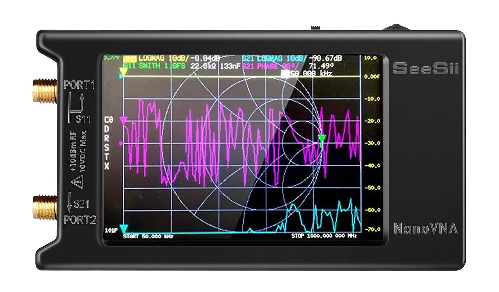

# Tool descriptions

<table data-header-hidden><thead><tr><th width="214">Name</th><th>Description</th><th width="100">Picture</th></tr></thead><tbody><tr><td>Impact driver</td><td>Used for driving bolts and screws of all types and sizes</td><td></td></tr><tr><td>Drill</td><td>Used for drilling holes</td><td></td></tr><tr><td>Deep impact sockets, 1/2" drive (7/16”, 1/2", 9/16”)</td><td>Only 3 sizes needed. Important to get non-chrome plated since impact driver will cause them to chip.</td><td></td></tr><tr><td>Mini screw driver set</td><td>Better to get individual screwdrivers than interchangeable bits since it's easy to loose pieces.</td><td></td></tr><tr><td>Hole saw (2 1/2")</td><td>Important to get hole saw with the right-fitting shaft</td><td></td></tr><tr><td>Hex socket bit (1/4" and 5/16")</td><td>Used with hose clamps (1/4") and self-tapping screws (5/16")</td><td></td></tr><tr><td>Hex socket adapter (1/2")</td><td>Attaches to impact driver for use with deep impact sockets.</td><td></td></tr><tr><td>Impact Bit Set</td><td>Mainly for Roberson's (square) and Phillip's (cross) bits. It's handy to have multiple of each on a holder like this (with a carabiner).</td><td></td></tr><tr><td>Automatic wire strippers</td><td>There are two varieties that exist - either will work.</td><td></td></tr><tr><td>Wire rope cutter</td><td>For cutting guy wire. Don't go cheap with these - get the expensive ones!</td><td></td></tr><tr><td>Channel locks</td><td>Handy for all sorts of things. Get a brand name pair - non-brand versions can be very frustrating to use</td><td></td></tr><tr><td>Wrenches (7/16”, 1/2", 9/16”)</td><td>Helpful to have in addition to the sockets. Don't get the ratcheting wrenches.</td><td></td></tr><tr><td>Rotary Hammer</td><td>For drilling into rock or concrete. Fits SDS plus bits.</td><td></td></tr><tr><td>Dewalt batteries (Spares)</td><td>Always have lots of spares ready and charged.</td><td></td></tr><tr><td>SDS plus masonry bit (5/8” x 6")</td><td>For drilling in anchors to rock or concrete</td><td></td></tr><tr><td>Swage tool</td><td>For crimping guy wire sleeves</td><td></td></tr><tr><td>Bolt cutters</td><td>Sometimes bolts get cross-threaded and need to be cut off.</td><td></td></tr><tr><td>Level</td><td>For making sure the tower structure is vertical.</td><td></td></tr><tr><td>Compass or compass app on phone</td><td>To checking antenna directions.</td><td></td></tr><tr><td>Mini sledge</td><td>To drive in anchors. Also helpful for moving stubborn housing brackets.</td><td></td></tr><tr><td>Phillips (cross) screwdriver</td><td></td><td></td></tr><tr><td>Drill bit kit (Cobalt)</td><td>For drilling pilot holes or bolt holes.</td><td></td></tr><tr><td>Clear plastic tubing (3/8" , 12" long)</td><td>To clear dust from holes drilled into rock or concrete</td><td></td></tr><tr><td>Safety Glasses</td><td>Use whenever using drill or rock hammer, or when working under someone.</td><td></td></tr><tr><td>N-95 masks</td><td>Use whenever drilling into rock or concrete.</td><td></td></tr><tr><td>Tape measure</td><td>For measuring!!</td><td></td></tr><tr><td>In-line wire tensioner tool</td><td>Makes tensioning guy wires a whole lot easier.</td><td></td></tr><tr><td>Ratchet (1/2" drive)</td><td>A backup for impact driver as well as in-line wire tensioner tool</td><td></td></tr><tr><td>Coax Wire Stripper</td><td>Used for thinner coax cables, such as RG58</td><td></td></tr><tr><td>LMR400 Wire Stripper</td><td>Used exclusively for LMR400</td><td></td></tr><tr><td>Ratcheting Coax Crimper</td><td>For crimping on coax connectors</td><td></td></tr><tr><td>Spade bits (1/2" and 1 1/2")</td><td>For drilling holes through walls to allow for AC extension cord (1/2") or coax cables (1 1/2").</td><td></td></tr><tr><td>Tool belt</td><td>There are several different styles - get one that suits you the best!</td><td></td></tr><tr><td>Tool belt drill holster</td><td></td><td></td></tr><tr><td>Tool box</td><td>For storing tools!</td><td></td></tr><tr><td>Parts organiser</td><td>For sorting all the various nuts and bolts</td><td></td></tr><tr><td>Utility Knife</td><td>Mainly to open boxes and packages</td><td></td></tr><tr><td>Wire cutter</td><td>Snipping wires, cutting of cable tie ends, etc.</td><td> </td></tr><tr><td>Digital Multimeter</td><td>To check voltages of solar setup, continuity, and wire resistance.</td><td></td></tr><tr><td>Contactless AC circuit tester</td><td>For checking if outlets are working and to see if there are wires within walls.</td><td></td></tr><tr><td>USB to ethernet adapter</td><td>Needed for wired connection to SensorStation. May also be needed if laptop is missing Ethernet port.</td><td></td></tr><tr><td>Ethernet cable</td><td>For wired connection to SensorGnome or SensorStation.</td><td></td></tr><tr><td>USB flash drive</td><td>Used for downloading data or configuring Wi-Fi on SensorStations</td><td></td></tr><tr><td>Soapstone Marker</td><td>To mark measurements on metal. Also called a welder's marker.</td><td></td></tr><tr><td>Flagging tape</td><td>Can be helpful when transporting large items, also for flagging certain tools so it doesn't get lost in the field.</td><td></td></tr><tr><td>NanoVNA</td><td>Used as an antenna analyser. Can check whether an antenna is damaged/unsuitable for use.</td><td></td></tr></tbody></table>
