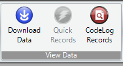

# Lotek SRX


For a complete guide on Lotek receivers, [Log in or Register](https://www.lotek.com/login/) to Lotek.org and then search for your receiver on the [support page](https://www.lotek.com/support/).


## Lotek SRX1200


Please note that this guide has been copied from [**Lotek's SRX1200 Host User Guide**](https://www.lotek.com/documents/srx1200-host-user-guide/). Please refer to that guide if any information here is inconsistent with the software you are using.



Data can only be downloaded from SRX1200 models with the "MD" or "D" suffix.


### Prerequisites

* [Lotek SRX1200 Host Software](https://www.lotek.com/documents/srx1200-host-software/)

### Instructions

1. Open the **SRX1200 Host** software, then click the "Download Data" button in the main menu\
   
2. A dialogue box will open with options for the data you wish to download. Select either "Download all log records", "Download All Logs since Last Download", or "Download range" and specify a date range you chose.\
   .png>)
3. Once downloaded, you will need to save the data file in a directory with a unique file name - we recommend checking the box next to "Use Date String" to keep file names unique. Data from the receiver will be saved as a binary .BIN file which will need to be converted in the next steps.\
   .png>)
4. To convert the file into something that can be uploaded to Motus, you can either:
   1. With the Download Data dialog box still open, click button "View" button next to the save button
   2. OR: Click "CodeLog Records" from the main menu.\
      \
      Then click the "Load" button and select the BIN file you want to convert.\
      .png>)
5. With the data loaded, click "Export" at the bottom of the Data Viewer dialogue. A new "Data Export Panel" dialogue will open.
6. Check the box next to "Export to SRX800 Legacy Format Files" and then click "Export".\
   .png>)
7. This will export three files to the same folder as the BIN file. **You will need to upload the DTA file to Motus.**

## Lotek SRX800


Please note that this guide has been copied from [**Lotek's SRX800 Host User Guide**](https://www.lotek.com/documents/srx800-host-user-guide/). Please refer to that guide if any information here is inconsistent with the software you are using.


### Prerequisites

* [Lotek SRX800 Host Software](https://www.lotek.com/documents/srx800-host-software/)

### Instructions

1. Open the **SRX800 Host** software, then click the "Data Download" button in the main menu.
2. On the right-hand side of the dialogue that opens, select the download type from the dropdown menu, then click the "Download" button and save the file with a unique name - we suggest the receiver serial number and the current date (e.g.: "Lotek-D012345\_20250101"). This will download a BIN file that will have to be converted in the next steps.
3. In the main menu, click the button "Text Conversion" and select the BIN file you wish to convert.\
   .png>)
4. If you set the GMT offset on the receiver, a "Check GMT Correction" dialogue box will open. **Always set GMT correction to 0h : 00m!**\
   .png>)
5. After clicking OK, it will create 3 new files with different file types. **You will need to upload the DTA file to Motus.**

