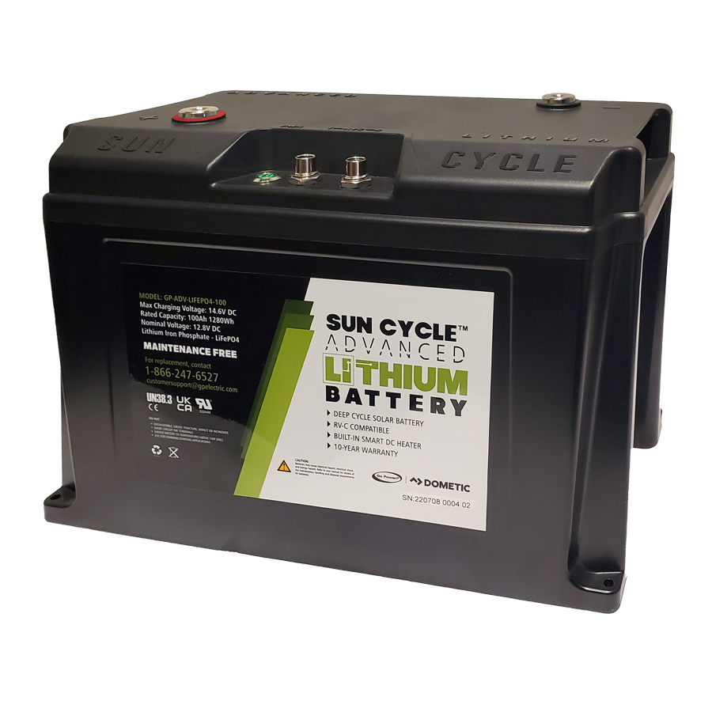

# Battery Storage and Maintenance

### Lead acid (AGM) vs Lithium (LiFePo4)

We work with two types of batteries:

* Lead Acid AGM - what most people are used to
* Lithium Iron Phosphate - for colder weather

Importantly, these chemistries _**Do not mix**!_ That means, no wiring them in the same circuit. That means, **we need multi-bank battery chargers.**

### Battery charging banks

Battery charging banks are essentially separate charging circuits, meaning they can charge batteries that have different voltages or chemistries.

The number of battery charging banks you will need for battery maintenance is 2, but it's a good idea to get 2 more for charging batteries that come in from the field.


**Do not** mix batteries with different charging states on the same bank.\
Also,\
**Do not** mix battery chemistries on same bank!


### Voltage and Amperage

All our batteries are 12-volts so you don't really need a charger that works at a higher voltage. The more important thing to consider is how much **Amperage** it outputs, **per bank**. You typically need about 0.5 Amps at 12 volts to maintain a single battery. So if you have 30 batteries, you'll need 15 Amps at 12 volts. If instead you have a 24 volt charger, you will only need 7.5 Amps as long as you wire two batteries in series per bank.

**Don't bother getting a 24 volt charger since it only allows you to charge an even number of 12 volt batteries.**

### Parallel vs Series wiring

When wiring together your batteries in a single battery bank, you want to put all the batteries that are in the same bank **in parallel. That means they all share the same positive and negative terminals.**

### Where to buy Battery Chargers

Here are a few options I found online, but there are many options which may suit your needs:

* 4 Bank, 40 Amps: [https://www.batterystuff.com/battery-chargers/marine-smart-chargers/noco-genius-12v-24v-36v-48v-40-amp-4-bank-waterproof-marine-on-board-battery-charger-genpro10x4.html](https://www.batterystuff.com/battery-chargers/marine-smart-chargers/noco-genius-12v-24v-36v-48v-40-amp-4-bank-waterproof-marine-on-board-battery-charger-genpro10x4.html)
  * Charges both Lead-acid and LiFePo4 batteries
  * Each bank can hold 20 batteries
* 4 Bank, 60 Amps: [https://www.batterystuff.com/battery-chargers/pro-charging-systems-dual-pro-12v-24v-36v-48v-60-amp-autoprofile-professional-series-4-bank-on-board-charger-ps4auto.html](https://www.batterystuff.com/battery-chargers/pro-charging-systems-dual-pro-12v-24v-36v-48v-60-amp-autoprofile-professional-series-4-bank-on-board-charger-ps4auto.html)
  * Charges both Lead-acid and LiFePo4 batteries
  * Each bank can hold 30 batteries

### Accessories

#### Bus Bars

These are needed for connecting cables from batteries to the same terminal, making cable management a lot simpler

* Dual bus bar, 10x2 connections: [https://www.amazon.ca/Blue-Sea-Systems-2702-Dualbus/dp/B000277JB4](https://www.amazon.ca/Blue-Sea-Systems-2702-Dualbus/dp/B000277JB4)
* You will need 1 of these for every 10 batteries.

#### Cables

Ideally, you can use the same cables that come with the batteries to connect them to the bus bar.&#x20;


Importantly, you must have a separate fused positive lead for each battery.


### Battery Shelves

As we all know, lead-acid batteries are _heavy!_ But it's also a pain how they take up so much room. Here are a couple of racks you can get at a decent price which can hold X batteries per shelf, turning floor space into vertical space.

| 
<strong>Model</strong> 
                         | 
HBR782478W4C-R 
                                                                                                                                                                                                                                                                                                                                                | 
HBR652454W3C-R 
                                                                                                                                                                                                                                                                                                                                                |
| --------------------------------------------------------- | ------------------------------------------------------------------------------------------------------------------------------------------------------------------------------------------------------------------------------------------------------------------------------------------------------------------------------------------------------------------------ | ------------------------------------------------------------------------------------------------------------------------------------------------------------------------------------------------------------------------------------------------------------------------------------------------------------------------------------------------------------------------ |
| 
<strong>Weight limit per shelf</strong> 
        | 
2,500 lbs 
                                                                                                                                                                                                                                                                                                                                                     | 
2,500 lbs 
                                                                                                                                                                                                                                                                                                                                                     |
| 
<strong>Number of batteries per shelf</strong> 
 | 
20 
                                                                                                                                                                                                                                                                                                                                                            | 
16 
                                                                                                                                                                                                                                                                                                                                                            |
| 
<strong>Number of shelves</strong> 
             | 
4 
                                                                                                                                                                                                                                                                                                                                                             | 
3 
                                                                                                                                                                                                                                                                                                                                                             |
| 
<strong>Total battery capacity</strong> 
        | 
80 
                                                                                                                                                                                                                                                                                                                                                            | 
48 
                                                                                                                                                                                                                                                                                                                                                            |
| 
<strong>Dimensions</strong> 
                    | 
77.0 (L) x 24 (W) x 78 (H) in 
                                                                                                                                                                                                                                                                                                                                 | 
64 (L) x 24 (W) x 54 (H) in 
                                                                                                                                                                                                                                                                                                                                   |
| 
<strong>Price</strong> 
                         | 
248 
                                                                                                                                                                                                                                                                                                                                                           | 
$228 
                                                                                                                                                                                                                                                                                                                                                          |
| 
<strong>Link</strong> 
                          | 
<a href="https://www.homedepot.ca/product/husky-77-inch-w-x-78-inch-h-x-24-inch-d-4-shelf-heavy-duty-industrial-welded-steel-garage-storage-rack-shelving-unit-in-red/1001621279">https://www.homedepot.ca/product/husky-77-inch-w-x-78-inch-h-x-24-inch-d-4-shelf-heavy-duty-industrial-welded-steel-garage-storage-rack-shelving-unit-in-red/1001621279</a> 
 | 
<a href="https://www.homedepot.ca/product/husky-65-inch-w-x-54-inch-h-x-24-inch-d-3-shelf-heavy-duty-industrial-welded-steel-garage-storage-rack-shelving-unit-in-red/1001621283">https://www.homedepot.ca/product/husky-65-inch-w-x-54-inch-h-x-24-inch-d-3-shelf-heavy-duty-industrial-welded-steel-garage-storage-rack-shelving-unit-in-red/1001621283</a> 
 |
| 
 
                                               | .png>)                                                                                                                                                                                                                                                                                                                  | .png>)                                                                                                                                                                                                                                                                                                                  |

### Battery Specs

| 
<strong>Model</strong> 
      | 
GP-AGM-100-12V 
                                                                                                                                              | 
GP-ADV-LIFEPO4-100 
                                                                                                                                |
| -------------------------------------- | ---------------------------------------------------------------------------------------------------------------------------------------------------------------------- | ------------------------------------------------------------------------------------------------------------------------------------------------------------ |
| 
<strong>Type</strong> 
       | 
Sealed lead acid, AGM 
                                                                                                                                       | 
Lithium Iron Phosphate 
                                                                                                                            |
| 
<strong>Capacity</strong> 
   | 
100 Ah 
                                                                                                                                                      | 
100 Ah 
                                                                                                                                            |
| 
<strong>Voltage</strong> 
    | 
12 V 
                                                                                                                                                        | 
12 V 
                                                                                                                                              |
| 
<strong>Dimensions</strong> 
 | 
12.0 (L) x 6.6 (W) x 9.0 (H) in 
                                                                                                                             | 
12.4 (L) x 6.9 (W) x 8.7 (H) in 
                                                                                                                   |
| 
<strong>Weight</strong> 
     | 
24.2 lb / 11 kg 
                                                                                                                                             | 
67.5 lbs / 30.6 kg 
                                                                                                                                |
| 
<strong>Link</strong> 
       | 
<a href="https://gopowersolar.com/products/12-volt-sun-cycle-agm-solar-battery/">https://gopowersolar.com/products/12-volt-sun-cycle-agm-solar-battery/</a> 
 | 
<a href="https://gopowersolar.com/products/100ah-advanced-lithium-battery/">https://gopowersolar.com/products/100ah-advanced-lithium-battery/</a> 
 |
| 
 
                            | .png>)                                                                                                                | 

<figure><figcaption></figcaption></figure>
                             |

