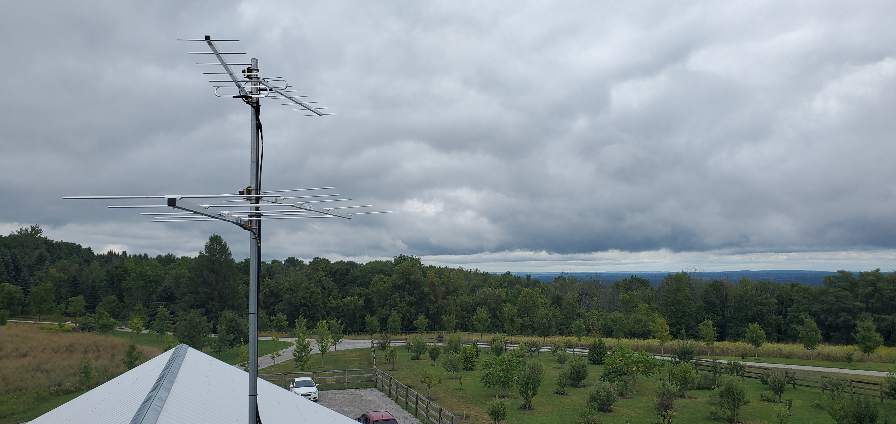
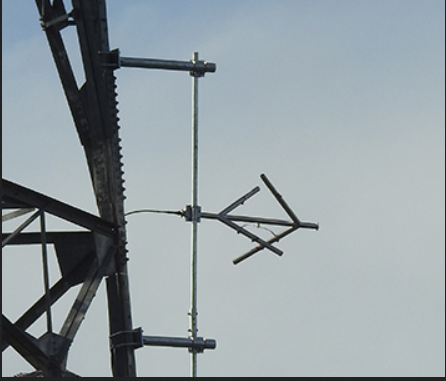

# Antenna Mounts for Co-Locates

Mounting Antennas on pre-existing structures may seem complex, but can be simplified in very easy and intuitive ways. The amount of variation possible is limited only by one's imagination, but typically the simplest solution can be the most robust and most reliable long term solution.

&#x20;

For mounting on Tower-like structures you are limited to 3 options:&#x20;

a) Mounting to the top mast of a tower

b) Mounting to a singular leg

c) Mounting to the 'face' of the tower via 2 legs.

&#x20;

### Mounting to the top mast of a tower

This option is the simplest, but is often the first to be eliminated for pre-existing towers as the top mast is either already full or simply does not exist as a feature of the tower. Ideally Coaxial cable runs for Motus setups should not exceed 60ft to minimize signal loss (see antenna diagrams), and existing structures often exceed this threshold.

### Mounting to a singular leg

This option can be as simple as connecting the antenna directly to the leg of the tower, though this should only ever be a temporary / short term measure as it is best to have separation from the tower for proper signal transfer, and to avoid encroaching on tower access via climbing. Large towers often have a designated 'climbing face' with a built in ladder and climbing arrest system, and space needs to be free of any/all obstructions. The utilization of extended mounts is often the best approach, but gravity and overall wind resistance are the limiting factors as the mount only has 2 contact points. These mounts are best used on larger structures where the legs are capable of withstanding the torsion forces applied by wind loading.

&#x20;

### Mounting to the 'face' of the tower via 2 legs

This option offers the best support, and is the method of choice for most applications.

For the above example, 2 lengths of aluminum angle were used to attach horizontally to the 'face' of the tower, utilizing U-bolts at each leg. A secondary vertical pipe is attached to the ends of the angle, with approximately 26" of room between the tower leg and mounting pipe. This spacing is just enough to allow the Yagi antenna to be oriented as desired, without the elements contacting the tower.

When custom making a face mount, it is important to keep in mind that for free standing towers, there is always a taper. This comes into play when designing the mounts, as you must be careful to mount the pipe as close to vertical as possible. The easiest way to ensure that the pipe will be mounted vertically, is by measuring out from your center, or plumb line on your mounts. The mounts shown here are approximately 26" apart, which for this tower amounted to a difference of ¾" between the two measurements. In order to properly place the vertical mounting pipe, I first measured between both inner U-bolt holes to find the exact center of the mount on the tower face. Once you have your center line (marked as a 'C' with a line through it) you simply measure the same distance from the center for each mount to were the pipe will be attached. For  smaller mounts a single U-bolt at each connection point is sufficient.

<figure><figcaption></figcaption></figure>

This effect is slightly exaggerated by the camera angle, but demonstrates the above principle:

<figure><figcaption></figcaption></figure>

<figure><figcaption></figcaption></figure>

<figure><figcaption>
Outside end of the mounts where the pipe will be mounted
</figcaption></figure>

<figure><figcaption>
A mount ready to be hoisted
</figcaption></figure>

<figure><figcaption>
Mounted antennas (note proper cable management)
</figcaption></figure>

Final notes:

It is important to always be aware of the climbing face, and to never obstruct tower access along the face. This includes avoiding mounting objects that would impede the horizontally welded ladder members of the tower. In the closeup picture above, it is mounted to the inside of the tower and is positioned pointing away from the climbing face. It is ok to mount on the inside of the climbing face, so long as it is positioned in such a way that it does not impede foot or handholds.

Always practice proper cable management. Never exceed 3ft of unsecured vertical cable, or 1ft for horizontal. Never place cable where it could be stepped on, always secure to vertical or diagonal tower sections, and if necessary to the bottom of horizontal tower pieces. Keep in mind that towers can accumulate a lot of ice, which will eventually chip off and fall. Placing cables on the underside of horizontal surfaces helps mitigate potential damage by falling objects.

<figure><figcaption></figcaption></figure>

#### Tower taper considerations:

Free standing towers taper inwards, so for mounts with a larger vertical span this will result in a difference of \~1" + of taper, and you will need to take that into consideration as your horizontal pole will be mounted on an angle inwards. This can be fixed by taking a secondary piece of angle on either the top or bottom mount (depending on if it is an inside or outside mount) and adjusting it by half of the difference between the top and bottom mounts. If the difference between the top and bottom mounting points is 1 inch, that means that the tower is tapering in on either side of the center line by 1/2 an inch.

<figure><figcaption>
Example of a mount that was made to correct for the inward taper
</figcaption></figure>

In this photo you can see the presence of an extra piece of angle attached to the top of the mount, moving the attachment point about a half of an inch inwards to account for the taper of the tower. This adjustment was done at the bottom to match the fact that it is tapering in at the top. (also note the double U-bolts to help negate potential twisting via wind load, as there is extra equipment mounted to the pole)

<figure><figcaption></figcaption></figure>

