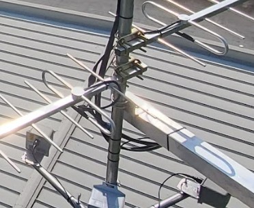

# Antenna Mounts for Tower Structures


Please note: This guide is still in its draft stages. Some of the information presented here may be inaccurate or imcomplete.


Mounting Antennas on pre-existing tower structures may seem complex, but can be simplified in very easy and intuitive ways. The amount of variation possible is limited only by one's imagination, but typically the simplest solution can be the most robust and most reliable long term solution. &#x20;

For mounting on Tower-like structures, you are limited to 3 options:  &#x20;

[A.) Mounting to the top mast of a tower](antenna-mounts-for-tower-structures.md#option-a-mounting-to-the-top-mast-of-a-tower)&#x20;

[B.) Mounting to a singular leg ](antenna-mounts-for-tower-structures.md#option-b-mounting-to-a-singular-leg)

[C.) Mounting to the 'face' of the tower via 2 legs](antenna-mounts-for-tower-structures.md#option-c-mounting-to-the-face-of-the-tower-via-2-legs)

### Option A: Mounting to the top mast of a tower

This is the simplest, but is often the first to be eliminated for pre-existing towers as the top mast is either already full or simply does not exist as a feature of the tower. Ideally coaxial cables for Motus setups should not exceed 60ft to minimize signal loss, and existing structures often exceed this threshold.&#x20;

<figure><figcaption>
Antennas on top of mast
</figcaption></figure>

### Option B: Mounting to a singular leg

This can be as simple as connecting the antenna directly to the leg of the tower, though this should only ever be a temporary / short term measure as it is always best to have separation from the tower for proper signal transfer, and to avoid encroaching on tower access via climbing. Large towers often have a designated 'climbing face' with a built in ladder and climbing arrest system, and space needs to be free of any/all obstructions. The utilization of extended mounts is often the best approach, but gravity and overall wind resistance are the limiting factors as the mount only has two contact points. These mounts are best used on larger structures where the legs are capable of withstanding the torsion forces applied by wind loading.  

<figure><figcaption>
Yagi antenna leg mounted on a large, angle-leg tower
</figcaption></figure>

### Option C: Mounting to the 'face' of the tower via 2 legs

This mount offers the best support, and is recommended for most installations. Two horizontal aluminum angles are attached to the tower face, spanning two tower legs. One or two vertical mast(s) are then attached to the outer end(s) of the angles.&#x20;

#### Common Installation Procedure

The following steps apply to all face-mount installations.

1. Select mounting locations on the tower face. Consider antenna orientation requirements and ensure sufficient clearance for antenna rotation.&#x20;
2. Keeping in mind that you will be attaching two horizontal aluminum angles (1/4" x 2-1/2" x 2-1/2" x 10ft) approximately 2 ft apart vertically, measure the centerline (plumb line) of the tower face and transfer it to both the aluminum angles.&#x20;
3. Lay out mast mounting locations symmetrically from the centerline, ensuring sufficient clearance between the tower and antenna elements (see _**Table**_ below).&#x20;

_**Table**: Recommended spacing between the tower leg and mounting pipe. This spacing is just enough to allow the Yagis to be oriented as desired, without the elements contacting the tower._

<table><thead><tr><th width="591.5999755859375">Antenna</th><th>Recommended space (inches)</th></tr></thead><tbody><tr><td>ZDA 5 element 166mhz yagi antenna</td><td>26 </td></tr><tr><td>ZDA 9 element 166mhz yagi antenna</td><td>TBD</td></tr><tr><td>ZDA 7 element 434 yagi antenna</td><td>TBD</td></tr></tbody></table>

4. Drill and prepare the aluminum angles as required. Use a bridge reamer to align holes if necessary.

<figure><figcaption>
UBolt holes in relation to center line of tower
</figcaption></figure> <figure><figcaption>
UBolt holes in relation to center line of tower
</figcaption></figure>

<figure><figcaption>
Outside end of the mounts, where the pipe will be mounted with UBolt
</figcaption></figure>

<figure><figcaption>
A single-mast mount ready to be hoisted
</figcaption></figure>

5. Attach the aluminum angles to the tower using the appropriate hardware described [below](antenna-mounts-for-tower-structures.md#attaching-the-aluminum-angles-to-the-tower).
6. Attach the mast(s) (1.5-inch diameter, 16-gauge, 5-ft) to both aluminum angles using U-bolts, pipe brackets, washers, lock washers, and nuts. Position the masts so that approximately equal lengths extend above and below the aluminum angles. For heavy antenna loads or long Yagis, consider using double U-bolts at mast attachment points to reduce twisting caused by wind loading.

<figure><figcaption>
Antenna (ZDA 5 element 166mhz) distancing from the tower 
</figcaption></figure>

7. Mount antennas according to the recommendations in the Antenna Placement section.&#x20;

<figure><figcaption>
 Mounted antennas
</figcaption></figure>

#### Attaching the Aluminum Angles to the Tower

**a) Tubular Tower Legs**

Attach the aluminum angles using appropriately sized U-Bolts around each tower leg.&#x20;

**b) Formed Channel Tower Legs**

Attach the aluminum angles using galvanized hex bolts through the flat face of the channel legs.&#x20;

* Use existing holes whenever possible.&#x20;
* Drill new holes only if necessary and with tower owner approval.&#x20;
* Avoid drilling near existing bolts, joints, or structural connections.

If new holes are required:

1. Drill through the center of the channel face using steel drill bits.
2. Begin with a pilot hole and enlarge gradually to the required diameter.
3. Repeat on the opposite tower leg, ensuring that corresponding holes are level and horizontally aligned.&#x20;

<figure><figcaption>
Green X indicates the flat face (middle) of the formed channel legs of the tower 
</figcaption></figure>

#### Mast Configuration&#x20;

**a) Single-Mast Configuration**&#x20;

Install one mast to one end of the aluminum angle assembly.

This configuration is suitable for lighter antenna loads and installations with limited wind loading.&#x20;

<figure><figcaption>
Example of face-mounted yagi antennas with one vertical mast
</figcaption></figure>

**b) Two-Mast Configuration**&#x20;

Install a mast at each end of the aluminum angle assembly. &#x20;

This configuation is recommended for heavier antennas and higher wind loads, such as 9-element 166 Yagis. Using seperate masts distributes loading and reduces stress on both the mount and tower.&#x20;

<figure><figcaption>
Example of face-mounted yagi antennas with two vertical masts
</figcaption></figure>

#### Tower taper considerations

Free standing towers taper inwards with height, meaning the distance between the tower legs at the upper mounting points may differ from the distance at the lower mounting points.&#x20;

To ensure the mast(s) remain vertical:&#x20;

1. Determine the centerline (plumb line) of the tower face at each mounting level.
2. Transfer the centerline to the upper and lower aluminum angles.&#x20;
3. Measure mast locations from the centerline rather than from the tower legs.&#x20;
4. Position mast attachment points at equal distances from the centerline on both upper an lower angles.

If the tower taper causes the horizontal aluminum angles to be mounted at slightly different widths, the mast may lean inward or outward. This can be corrected by adding a secondary piece of aluminum angle at either the upper or lower mounting point (depending on the mount configuration) to offset the mast attachment location.

The required offset is equal to one-half of the difference between the upper and lower mounting widths. For example, if the distance between the tower legs differs by 1 inch between the upper and lower mounting locations, the tower tapers inward by 1/2 inch on each side of the centerline. In this case, the mast attachment point should be shifted by approximately 1/2 inch to maintain a vertical mast.

The figure below shows an example where an additional piece of aluminum angle has been installed to shift the mast attachment point inward and compensate for tower taper.&#x20;

<figure><figcaption>
A mount that was made to correct for the inward taper
</figcaption></figure> <figure><figcaption></figcaption></figure>

#### Mount and cable organization

It is important to always be aware of the climbing face, and to never obstruct tower access along the face. This includes avoiding mounting objects that would impede the horizontally welded ladder members of the tower. In the figure below, it is mounted to the inside of the tower and is positioned pointing away from the climbing face. It is okay to mount on the inside of the climbing face, so long as it is positioned in such a way that it does not impede foot or handholds. &#x20;

<figure><figcaption>
 Mounted antennas
</figcaption></figure>

Always practice proper cable management. Never exceed 3ft of unsecured vertical cable, or 1ft for horizontal. Never place cable where it could be stepped on, always secure to vertical or diagonal tower sections, and if necessary to the bottom of horizontal tower pieces. Keep in mind that towers can accumulate a lot of ice, which will eventually chip off and fall. Placing cables on the underside of horizontal surfaces helps mitigate potential damage by falling objects.&#x20;
