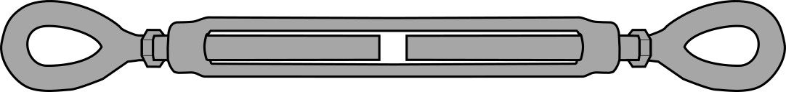

# Rock Anchored Lattice Tower

## Before you go

1. Check for wiring to solar panel, battery, and receiver. Make sure you have the wiring and connectors needed.
2. Cover the battery terminals. It can be easy to accidentally short the battery terminals with a tool or cable which is a fire hazard.
3. Use the hole saw that’s the same size as the pipe elbow and a drill bit to cut a hole into the short side of the action packer. Attach the pipe elbow and the bushing.
4. &#x20;Tape tool boxes shut to prevent them from opening accidentally. Zip tie larger totes shut, too.

## Parts Checklist

### Tools

<table data-header-hidden><thead><tr><th width="345">Name</th><th width="111">Quantity</th><th>Description</th></tr></thead><tbody><tr><td>Impact driver</td><td>2</td><td> </td></tr><tr><td>Drill</td><td>2</td><td> </td></tr><tr><td>Deep impact sockets (7/16”, 1/2", 9/16”)</td><td>1 of each</td><td> </td></tr><tr><td>Mini screw driver set</td><td>1</td><td>Small enough to fit screw terminals on the receiver and charge controller</td></tr><tr><td>Cobalt drill bit, 5/16 or 1/4”</td><td>1</td><td> </td></tr><tr><td>Hole saw (2 1/2")</td><td>1</td><td> </td></tr><tr><td>Automatic wire strippers</td><td>1</td><td>Has orange handles</td></tr><tr><td>Wire cutter</td><td>1</td><td>Has red handles</td></tr><tr><td>Channel locks</td><td>1</td><td>Large adjustable pliers with red handles</td></tr><tr><td>Wrenches (7/16”, 1/2", 9/16”)</td><td>1 of each</td><td> </td></tr><tr><td>Rotary Hammer</td><td>1</td><td>Large dewalt tool</td></tr><tr><td>Dewalt batteries</td><td>All of them</td><td>Make sure they’re charged, of course!</td></tr><tr><td>SDS plus 5/8” masonry bit</td><td>2</td><td>About 6 inches long. For rotary hammer.</td></tr><tr><td>Swage tool</td><td>1</td><td>Large crimping tool with blue handles. May not have arrived.</td></tr><tr><td>Bolt cutters</td><td>1</td><td> </td></tr><tr><td>Level</td><td>1</td><td>For making sure tower is level!</td></tr><tr><td>Compass or compass app on phone</td><td>1</td><td>For checking antenna directions</td></tr><tr><td>Mallet</td><td>1</td><td>For inserting anchors into rock</td></tr><tr><td>Phillips (cross) screwdriver</td><td>1</td><td> </td></tr><tr><td>Drill bit kit</td><td>1</td><td> </td></tr><tr><td>Clear plastic tubing</td><td>1</td><td> </td></tr><tr><td>Safety Glasses</td><td>2</td><td>For drilling into rock</td></tr><tr><td>N-95 masks</td><td>3-4</td><td>For drilling into rock</td></tr><tr><td>Tape measure</td><td>1</td><td> </td></tr></tbody></table>

## Setup instructions

### Base Plate

1.  Find an elevated and relatively flat rocky location large enough to fit the base plate (\~1 foot in diameter)

    <figure><figcaption></figcaption></figure>
2.  Place the base plate on the ground and use a metal tool or grease marker to mark the center of each hole in the base plate.

    <figure><figcaption></figcaption></figure>
3.  Wearing safety goggles and an N-95 mask, use the rotary hammer to drill each hole about 3 inches deep. You should hold both handles while drilling – if you only hold the trigger it can break your wrist! Use the clear plastic tubing to blow the rock dust out of the hole periodically. You will likely need to replace the battery between holes.

    <figure><figcaption></figcaption></figure>

    <figure><figcaption></figcaption></figure>
4. Place a wedge anchor in each hole with the threads facing up and use the mallet to drive the anchor into the hole as far as it will go.
5. Put the base plate over the wedge anchors and then add the washers then nuts to each wedge anchor. Use the channel locks to tighten the nuts as much as possible.

### Anchors for guy wires

1.  Using the tape measure, mark a position on the bedrock that is _at least_ 7 feet (213 cm) from the base of the tower, starting from one of the corners of the triangular base plate. Do this for each of the 3 corners.

    <figure><figcaption>
Top view of the example station setup, showing base plate in the center and three locations for <strong>Guy Line Anchors</strong> marked with an "X"
</figcaption></figure>
2.  Wearing safety goggles and an N-95 mask, use the rotary hammer and 5/8” masonry bit to drill each hole about 2 1/2 inches deep. You should hold both handles while drilling – if you only hold the trigger it can break your wrist! Use the clear plastic tubing to blow the rock dust out of the hole periodically. You will likely need to replace the battery between holes.

    <figure><figcaption></figcaption></figure>

    <figure><figcaption></figcaption></figure>
3. Place an expansion eye bolt in each of the drilled holes and use a mallet to drive them in. Use a wrench or channel lock to tighten the nuts on the top of each eye bolt.

### Top kit



1. Open up the top kit box and baggies. It comes with instructions for two models – ours is the 244A so don’t worry about the diagrams with the U-bolts. The video below walks through these instructions. Follow instructions and video to put together this part. The only difference is that you’ll also be attaching the guy station brackets to the top where the bolt holes go.  You won’t be using the larger V-shaped pieces of the guy station.     &#x20;

<figure><figcaption></figcaption></figure>

### Guy wires

1.  Take free end of the wire still attached to the spool and thread two crimps onto it. Feed the wire rope back through the crimps to make a small loop.

    <figure><figcaption></figcaption></figure>

    <figure><figcaption></figcaption></figure>
2.  Add a wire rope thimble to the loop and the pull the wire rope to tighten the loop around it. Use the swage tool (if you have it) or the wire cutters to crimp the wire crimps onto the wire rope. If wire cutters are too difficult, you can also try the bolt cutters, but be gentle!

    <figure><figcaption></figcaption></figure>

    <figure><figcaption></figcaption></figure>
3.  Attach a carabiner to the looped end and attach the carabiner to one the guy station brackets on the tower. Unspool about 15 feet (4.5 m) of wire rope, but don’t cut it yet.

    <figure><figcaption></figcaption></figure>
4. Raise the tower and sit it onto the base plate in the position you imagine it to be when it’s finally set up. Use the level (it should be magnetic) to make sure the tower is vertical during the following steps.
5.  With someone holding the tower (and ensuring the tower stays level), bring the spooled end of the guy wire to the eye bolt closest to that corner of the tower. While pulling the guy wire taught, measure about 1 foot (30 cm) beyond the eye bolt and then cut the cable using wire cutters.

    <figure><figcaption></figcaption></figure>
6.  On the new end of the cable segment you just cut, thread on 2 guy wire crimps and then feed the guy wire back through the 2 crimps to make a small loop. Add a wire rope thimble and then attach a turnbuckle to the new looped end of the cable. Don’t crimp the guy wire crimps yet!

    <figure><figcaption></figcaption></figure>
7. Loosen the turnbuckle almost all the way until 1 turn or so before the bolt would come out.
8.  Attach a carabiner to the free end of the turnbuckle and the carabiner to the expansion eye bolt.

    <figure><figcaption></figcaption></figure>
9. Pull on the loose end of the guy wire until the guy wire is mostly taught and then crimp the guy wire crimps.
10. Repeat steps 2 thru 10 for the two other corners of the tower.

### Mast

1. These steps are a bit complicated because you won’t be able to climb the tower to adjust the antenna bearings once the tower has been raised. You may have to adjust the antenna bearings multiple times before you’re satisfied with their position.
2. Lean the tower on a rock or the storage bin so the top is in the air.
3. Slide the mast into the top kit so the bottom is about 1 inch below the lower clamp of the top kit. Tighten the bolts so the mast doesn’t want to slide around.
4. Slide on the two Yagi antennas, starting with green and then yellow (green is on the bottom).
5. Slide on the two omni mounting brackets and then slide the omni on to the bracket. Tighten the bolts on the bracket until the omni is fixed firmly in place.
6. Attach the RED coax cable to the omni and zip tie it to the mast below it.
7. Slide up the YELLOW antenna until it’s directly below the omni and fix it firmly in place.
8. Use a compass or compass app on your phone to get the bearings for the two directions you’d like to point your Yagis.
9. Move the GREEN antenna until it is about 2 feet below the YELLOW antenna and then rotate it until the relative angle between the two antennas is the same as the angle between the two bearings you’d like to point them. Tighten the larger U bolts to fix the antenna firmly in place.
10. Rotate the angle of the antenna elements to ensure both Yagi antennas will be properly horizontal and once the tower is raised and then tighten the smaller U bolts to fix them firmly in place. Since the tower is leaning over in this step, it might be easier to make them horizontal if you just make sure the elements are perpendicular to the mast.
11. Get the compass bearing for one of the points on the base plate and then estimate how you’ll have to rotate the mast so the antennas are pointing in the intended direction once the tower is raised.
12. Tighten all the bolts on both mast clamps so the mast is fixed firmly in place.
13. Zip tie the coax cable to the mast all the way down the tower and then use the wire clips to clip off the ends of the zip ties.

### Raising the Tower

1. Use the channel locks to squeeze the attachment points on the base plate so they are a little closer together.
2. Open the package of nuts and bolts that was attached to the base plate.
3. Carefully raise the tower and place on each of the attachment points.
4. With 2 people holding the tower up, check the antenna bearings to make sure they’re pointing in the right direction. If you need to adjust, lower the tower back down and try again.
5. With 2 people holding the tower up, a third person can start inserting the bolts into the attachment points. Bolts should be pointing inward to avoid scraping ankles on the ends. The feet of the tower will be raised a bit – this is normal. After putting a bolt in, add a lock washer and a nut on the other end. You only need it finger tight until all bolts are inserted.
6. Attach each guy line to their anchors, but make sure all the turnbuckles are still loose.
7. Use the magnetic level to make sure the tower is level. The people holding the tower should continuously ensure the tower is level as you start tightening the turnbuckles. You will likely have to tighten all the turnbuckles part way before doing a final tighten. You want the guy wires to be taught.
8.  Tighten the nut on the turnbuckles to lock them in place and they won’t rotate any more.

    <figure><figcaption></figcaption></figure>

