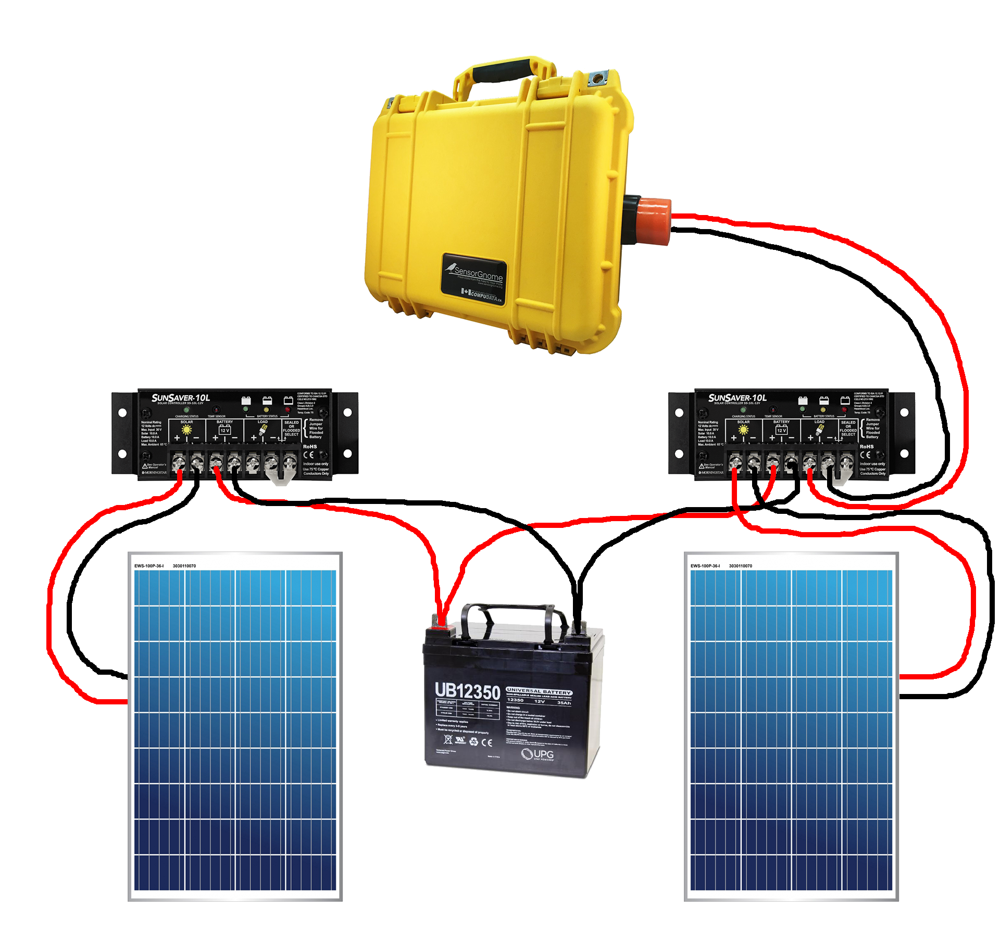
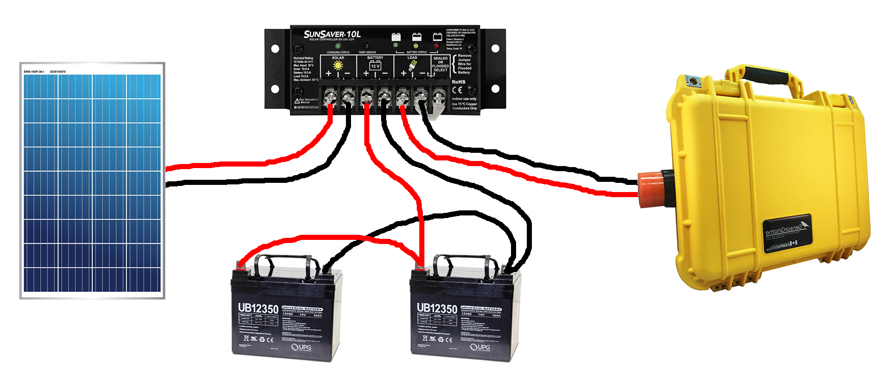

# Solar Power

## Wiring options

There is more than one way to wire everything together for solar power. This will largely depend on what equipment is available to you.&#x20;

Below are two examples of two typical setups with different types of batteries, connections, charge controllers, and receivers, but in any part can be swapped out for the other.

<figure><figcaption></figcaption></figure> <figure><figcaption></figcaption></figure>

### Alternate wiring

In some cases, you may need to use two batteries or two solar panels. This will effect what kind of setup you need. If you use two batteries, they can share the same charge controller, but the MUST be the exact same make and model of battery, otherwise you will need to use two charge controllers. Similarly, you can use two solar panels, but it's generally recommended that they each use their own charge controller since they may have different voltages and one can damage the other.

In cases where batteries or solar panels are wired to the same charge controller, they must be wired in parallel (both negatives go to negative terminal on charge controller, both positives to positive terminal)

<figure><figcaption></figcaption></figure> <figure><figcaption></figcaption></figure>


Make sure the solar panel(s) maximum output current does not exceed 80% of the maximum current of the charge controller. All panels will have the maximum current printed on the back. All charge controllers will also have a maximum current rating, usually in the product name as well as in the specs (e.g.: SS-10L-12v means 10 amps max).

\
If you are using two solar panels, you need to add the maximum current for the panels together to get total.


Read more about charge controllers in [Station Equipment](https://docs.motus.org/en/stations/station-equipment/power#charge-controller).

## Supplies

* [Solar Panel](solar-power.md#solar-power)
* [Battery](solar-power.md#battery)
* [Charge Controller](solar-power.md#charge-controller)
* [14 AWG Spade](https://www.homedepot.com/p/Gardner-Bender-16-14-AWG-4-6-Stud-Spade-Terminal-Vinyl-Blue-10-Pack-15-113/205846650) [connectors](https://www.homedepot.com/p/Gardner-Bender-16-14-AWG-4-6-Stud-Spade-Terminal-Vinyl-Blue-10-Pack-15-113/205846650)
* [Fused battery leads](https://www.amazon.ca/dp/B07CK784LZ/ref=cm_sw_em_r_mt_dp_VNB6X9BCDCWWCVNN4C0A?_encoding=UTF8\&psc=1)
* 14 AWG stranded automotive or speaker wire.

## Tools

* Phillips screwdriver
* Small flat head screwdriver
* [Stripper/crimping tool](https://www.homedepot.com/p/Klein-Tools-Klein-Kurve-Multi-Tool-Wire-Stripper-Crimper-1019SEN/305303655)
* Multimeter


[parts-list-and-suppliers.md](../station-equipment/parts-list-and-suppliers.md)


## Instructions

1. Prepare your cables by crimping **14 AWG spade connectors** to the ends of all your cables.
   * For the battery, prepare one **fused battery lead** and one length of the **14 AWG stranded automotive/speaker wire**.
2. Carefully inspect the charge controllers and note the positive and negative terminals for: the Solar Panel (input); the battery; the load (output).
3. Ensure the power rating on the back of the solar panel does not exceed the ratings of the charge controller.
4. Loosen the positive and negative terminals of the battery and attach the battery cable one at a time, using a **fused battery lead** for the _positive terminal_ and **14 AWG stranded automotive/speaker wire** to the _negative terminal_.
5. Loosen the _positive and negative terminals for the battery_ on the **solar charge controller** and attached the battery cables, beginning with the positive side.
6. Proceed to connect the solar panel cables to the solar charge controller, again beginning with the positive side.
7. Finally, connect the load (receiver) to the load terminals of the solar charge controller, positive first.


**Motus Pro Tip**

Sometimes the charge controller may indicate the battery level is low, or will cycle through different levels when first connected. This is normal as it is calculating the average voltage over time to gain an accurate measurement. Give it a couple minutes to settle before checking the indicator lights again.

