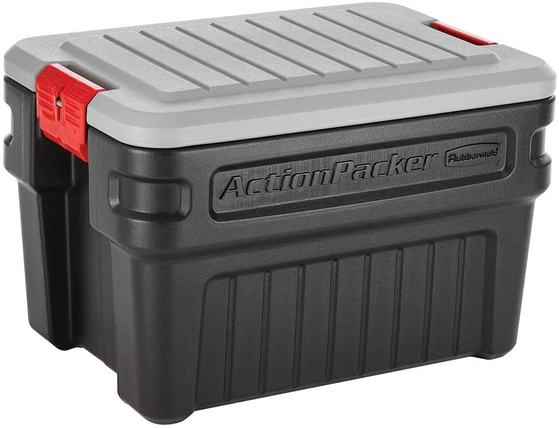

# Storage Container


There can be a significant risk of damage to your equipment due to flooding, rodents, or other animals. See information at the end of this chapter for precautions.


### Heavy-duty Container


**Motus Pro Tip** - DO NOT USE just any plastic container, or other plastic storage boxes that are not meant to be kept outside for extended periods of time.


#### Supplies

* 90L Rubbermaid Action Packer or equivalent heavy-duty, waterproof container.
  *   If using an alternative, ensure the container is actually

      waterproof and the lid is not concave such that water pools on

      top. Handles will need to be closed securely either with zip

      ties or a lock.
* To prevent water ingress:
  * 2-inch pipe elbow (90 degrees) similar to: [NIBCO 2 in. ABS DWV 90-Degree H x H Vent Elbow-C5807VHD2](https://www.homedepot.com/p/NIBCO-2-in-ABS-DWV-90-Degree-H-x-H-Vent-Elbow-C5807VHD2/100344401)\
    
  * 2-inch pipe bushing, similar to: [2 in. x 1-1/2 in. ABS DWV Spig. x Hub Flush Bushing-C58012FHD2112](https://www.homedepot.com/p/2-in-x-1-1-2-in-ABS-DWV-Spig-x-Hub-Flush-Bushing-C58012FHD2112/100342353)\
    
  * Electrical tape or ABS cement
* Zip ties
* \[**Optional**] To prevent insects and rodent ingress
  * Plastic bags and/or steel wool.
  * Aluminum window screening.
  * JB Weld epoxy or equivalent.
    * Container and stir stick for epoxy.
  * Tool to cut into underside of container (e.g.: exacto knife).

#### Tools

* Drill
* [2” hole saw](https://www.homedepot.com/p/Milwaukee-2-in-Hole-Dozer-Bi-Metal-Hole-Saw-with-3-8-in-Arbor-Pilot-Bit-49-56-9667/202327737)
* 1/4" or similar sized drill bit


[parts-list-and-suppliers.md](../station-equipment/parts-list-and-suppliers.md)


#### Instructions

1. Drill 2” hole on one end of the Action Packer, about 6" from its base.
2. Place the 2-inch pipe bushing through the hole from the inside of the bin.
   1. Apply a single layer of electrical tape or ABS cement to the exposed end of the bushing on the outside of the bin.
   2. Attach the 2-inch pipe elbow to the bushing from the outside of the bin and force into place with the open end of the elbow pointing down.
   3. Using the 1/4" drill bit, drill a couple holes in each of the bottom corners of the bin. This is to prevent water from pooling if it gets in somehow.
3. \[**Optional**] To prevent insect and rodent ingress
   1. Cut a pieces of aluminum window screen large enough to cover the holes drilled into each of the corners of the bin.
   2. Prepare the epoxy
   3. Place the piece of aluminum window screen over the hole and apply a generous amount of the mixed epoxy around the entire edge, ensuring no gaps remain.
   4. Once you have inserted all necessary cables into the bin, including your GPS and SensorGnome, you will need to pack the remaining space in the elbow with plastic bags (insects) and/or steel wool (rodents).
